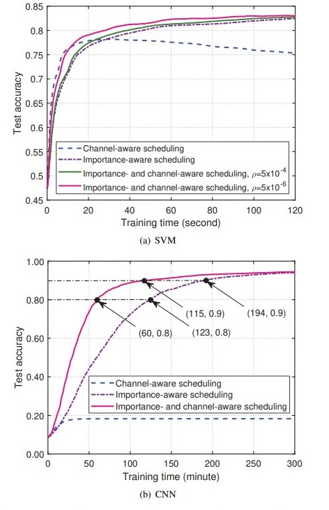

# Importance and Channel Aware Federate Learning
Scheduling for Cellular Federated Edge
Learning with Importance and Channel
Awareness

https://arxiv.org/pdf/2004.00490.pdf

本次 paper 是在面试一个做 federate learning 的老哥，他写的一个 paper。先简单说一下 federate learning 把，其实 federate learning 本质就是在做一个数据分布、模型分布的一个分布式训练。但是对于一些巨大数据集来说，这种分布式其实是比较有效的，而且每次回传梯度的时候，只带有梯度信息，可以做到数据不泄漏的目标。保护用户数据隐私非常有用。

本篇 paper 就是针对这个数据分布不均衡、网络带宽有限制的情况下，想要得到一个速度最快的近似最优解的算法。

1. 数据集分布：假设我有 $K$ 个 device，第 k 个 device 可以 access 的数据集是 $D_i=((x_k^1, y_k^1), ..., (x_k^{n_k}, y_k^{n_k}))$，
2. loss function：对于第 k 个 device，我们可以定义 loss function 是 $L_k(w) = \frac{1}{n_k}\sum_{i=1}^{n_k} l(w, x_k^i,y_k^i)$
3. global loss function 则为 $L(w) = \frac{1}{n}\sum_{k=1}^K n_k L_k(w)$

Federate Learning Mechanism

这里就说一下 federate learning 的常规流程：
1. global model broadcast：edge server 把当前的模型参数 $w_t$ 广播到所有 device
2. local gradient calculation：本地梯度计算 $g_k^t=\nabla L_k(w^t)$
3. importance indicator report：计算每个 device 的 importance，以便于下一步更新梯度的时候有一个权重可以参考 
4. device selection and resoource allocation：edge server 会根据上一步的 importance 选取当前的一个 subset device，以及也要考虑 bandwith 带来的影响
5. local gradient upload：进行梯度的传输
6. global model update：根据收到的梯度信息，对 global model 进行 bp

Definition 1（Probabilistic scheduling）对于第 t 次通讯轮次，edge server 会选取一个 device 的子集，根据一个概率分布 $P^t = (p_1^t, p_2^t,...,p_K^t)$，最终的一个 edge server 计算的 global gradient 应该是：
$$
\hat g^t = \frac{n_{X^t}}{np_{X^t}^t} g_{X^t}^t
$$

Lemma 2（One-round convergence rate）是指收敛性条件 假设 $w^*$ 是一个理论最优（上帝视角中，可以 access 到所有数据的情况下的一个最优的梯度，那么第 t+1 轮进行的梯度下降的 $w^{t+1}$ 和 这个最优 $w^*$ 的 upper bound 是可以被估计的：
$$
E\{L(w^{t+1}) - L(w^*)\} \leq E\{L(w^t)-L(w^*) - \eta^t(1-l\eta^t/2)||g^t||^2+l(\eta^t)/2*E\{||\hat g^t - g^t||^2\}\}
$$
所以我们的这个估计的算法是可以被某一个 upper bound 进行估计的

优化问题描述:
$$
minimize_{p_1^t,...,p_K^t}\sum_{k=1}^K p_k^t(\rho ||\frac{n_k}{np   _k^t} g_k^t - g^t||^2) \\
s.t.\ \ \sum_{k=1}^K p_k^t = 1 \\
p_k^t \geq 0, \forall k\in \mathcal K
$$

最后可以解得，这个 edge server 可以得到计算得到一个最优的概率分布
$$
p_k^{t*} = \frac{n_k}{n}\sqrt{\frac{\rho}{(1 - \rho)T_k^{U,t} + \lambda^{t*}}},\forall k
$$
从这个式子里我们可以得到一些结论：
1. 对于数据量越多的 device，他被选中的概率越高
2. 对于梯度传输带宽延迟 $T_K$，对于延迟越高的，被选取的概率就越小，这个结论也比较符合直觉
3. 对于当前梯度的二范数值越大，被选中的概率越高，这个也比较好理解，二范数越大说明对 weight 的改变更多，那这样对于每次 bp 的时候能够更接近 optimal loss minimum
4. $\rho$ 和 $\lambda$，前者和后者都是拉格朗日乘子的正则化乘子
5. 和最优梯度 $w^*$

最后我们看一下结果：

