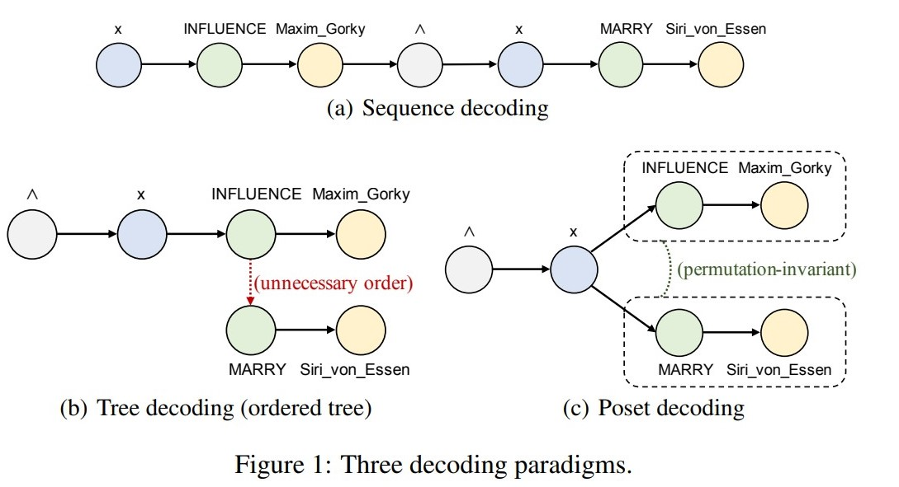
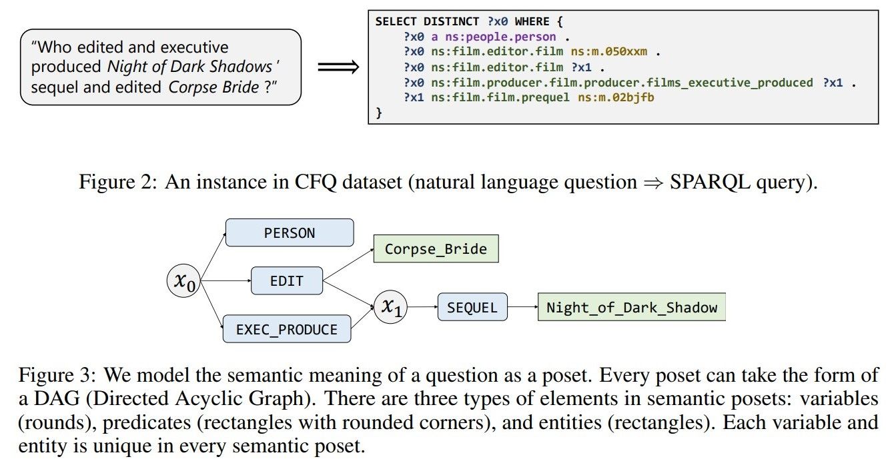

# Hierarchical Poset Decoding

Hierarchical Poset Decoding for Compositional Generalization in Language

https://arxiv.org/pdf/2010.07792.pdf

Semantic Parsing 语义解析，是近几年发展起来的一个 nlp 的分支方向，主要目的是将自然语言的文本描述，自动转成机器语言（主要是 sql），也称为 text-to-sql，nl2sql 等。随着知识图谱的发展，也逐渐孵化出很多 nl2Cypher 算法。

传统的一些 semantic parsing 的算法对于解析的过程，都是 sequence 类型的，比如 seq2seq 的这种解码方式。但是实际上，我们的一句自然语句，并不应该解码成 sequence 的结构，而是某些 tocken 之间需要保留顺序信息，某些 tocken 之间不需要保留顺序信息，或者说他们之间没办法进行排序。本文中提到树结构也不满足这种顺序，可能默认子树之间存在顺序关系（但是其实可以定义某种子树不相关的解码方式）。于是本文的 poset decoding 是一种偏序关系的解码方式，这样就保留了需要保留的序关系，而无法对比的两个 tocken 之间就不做序关系比对。

CFQ dataset：是包含 自然语言问题（in English）和 含有 sparql 意义的代码段的一个对子的数据集。 
1. Minimizing primitive divergence：所有 primitives 都会出现在 train set 和 test set，而且 distribution 也近乎相同
2. Maximizing compound divergence：compounds （logical substructures in SPARQL）在 train set 里会尽可能地不同于 test set
3. 第二条特点会导致，compoositional 会非常有挑战性
4. 变量，实体，谓语等等都是会出现的在 loogical queries 里面的词种

Poset：
1. poset 的一些定义其实就是偏序关系的一些定义。
2. 最后训练出我们的 poset 的图

1. primitive prediction 输入 nl，得到一个 candidate primitives 的 set 的 prediction
2. sketch prediction 是预测图结构
3. 将两者结合，得到一些 candidate path
4. 将这些 candidate path进行预测，得到最后的结果

最后评价是，用 celoss，以及和数据库真实交互的结果来判断是否是正确的。
