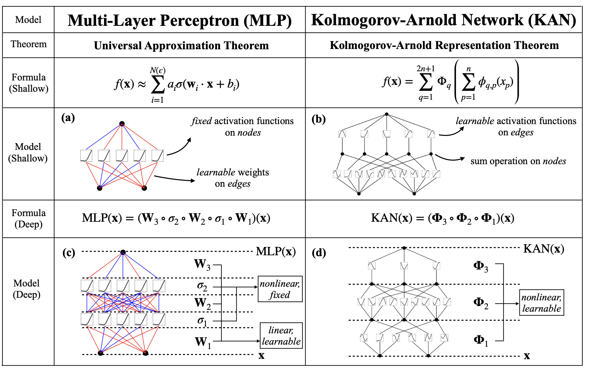
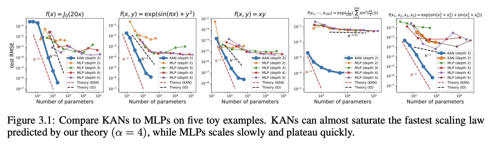

### KAN

Kolmogorov-Arnold Networks

https://arxiv.org/pdf/2404.19756

两位伟大的数学家 Andrey Nikolaevich Kolmogorov，最著名的就是对概率论公理化所作出的贡献。和 Vladimir Arnold 最著名的成果是关于可积哈密顿系统稳定性的 KAM 定理

#### Introduction

mlp 的表达能力是基于 universal approximation theorem 保证的，但是 mlp 的结构是有一定缺陷的 "MLPs consume almost all non-embedding parameters and are typically less interpretable without post-analysis tools"

KAN 是被 Kolmogorov-Arnold representation theorem 激发的 idea. KA 表示定理是解答 23 个 hilbert 问题的第 13 个问题: Every multivariate continuous function f: [-0,1]^n -> R can be represented as a superposition of the two-argument addition of continuous function of one variable. Which solved a more constrained form of Hilbert's thirteenth problem. So the original Hilbert's thirteenth problem is a corollary

KAN 和 MLP 的构造大体相同，为数不多的区别就是 KAN 没有 linear weight matrices，取而代之的是 learnable 1D function parametrized as a spline

这里定义一下 b-spline 函数，是 basis spline 的简称，可以看成一些列控制点 P control points 和 权重函数 N weight function 的线性组合。简而言之，b-spline 曲线就是每个控制点乘以与之对应的权重函数的加权和. 控制点是我们后期指定的, 而权重函数是我们预先定义好的，只跟阶数 D 有关系，不会因为控制点变化而变化

KAN 本质就是 spline function + mlp

KAN 对低维函数拟合很容易，因为 easy adjust locally，但是有严重的 curse of dimensionality problem；mlp 不会 cod，但是精度不如 kan

接下来的环节，paper的流程框架是 kan architecture, mathematical foundation；PDE solving experiment comparation；

#### KAN

Kolmogorov-Arnold Representation theorem 如果 f 是一个有界的多元连续函数，那么 f 就能被写成有限个连续单元函数的复合的有限相加
$$
f(x)=f(x_1,...,x_n) = \sum^{2n+1}_{q=1}\Phi_q(\sum_{p=1}^n \phi({q,p}(x_p)))
$$
Architecture

问题在于 ka 表达定理，本质上其实说的是一个2层kan的结构，也就是说如果2层kanlayer就足够拟合任何multivariate function，那么为什么还需要多层呢？（疑惑的点）可能是说，predefine 的 layer 数目不符合 ka 定理的条件，所以需要叠加多层。然后就需要定义什么是 kanlayer，当我们定义好了 kanlayer 时，就可以像 mlp 一样简单 stack 单个 kanlayer 即可。

一个 $n_{in}$ $n_{out}$ 纬度的可以定义为 $\Phi=\{\phi_{q,p}\},p=1,...,n_{in},q=1,2,...,n_{out}$

然后呢，每层的维度设置为 $n_l$的话，那么第 l 层和第 l + 1 层的 learnable function 个数为 $n_l \times n_{l+1}$，因为 $x_{l+1,j}=\sum_{i=1}^n\tilde x_{l,j,i}=\sum_{i=1}^{n_{l}}\phi_{l,j,i}(x_{l,i})$

公式在就比较好理解如何构造每层 KAN layer了。其中 SiLU 是 KANLayer 默认的激活函数，定义为 $SiLU(x) = 1/(1 + exp(-x))$

Implementation details

残差激活函数 $\phi(x) = w(b(x) + spline(x))$ 其中 b 就为 silu，spline 函数则是参数化为 b-splines 的线性组合，比如 $spline(x) = \sum_i c_iB_i(x)$

initialization scales 初始化比例

update of spline grid 更新 spline grid：如何更新

----

代码

https://github.com/KindXiaoming/pykan/tree/master/kan

