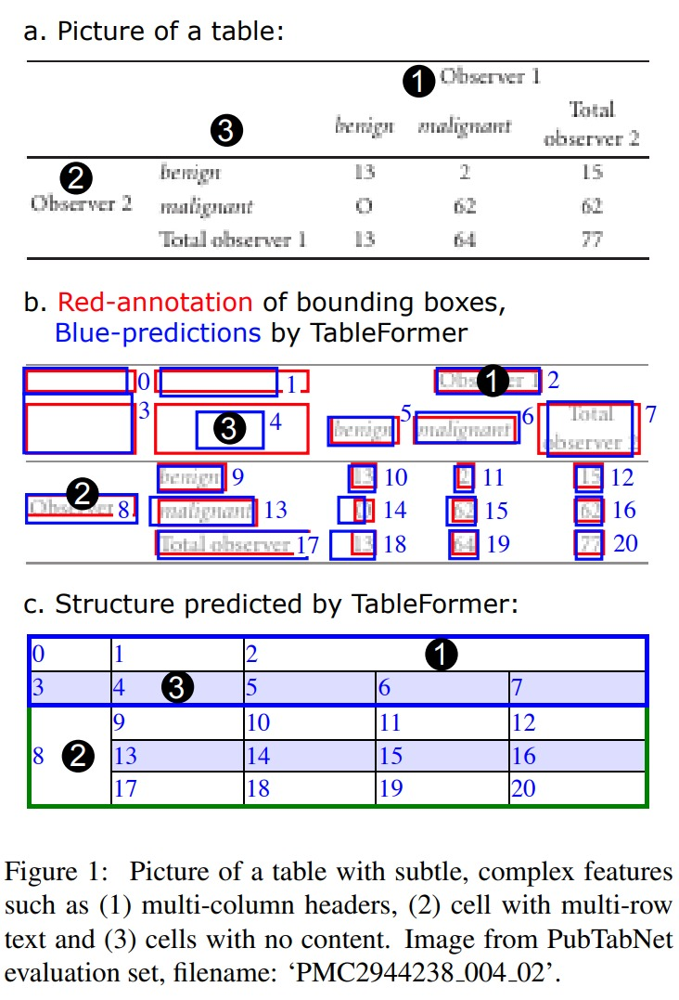
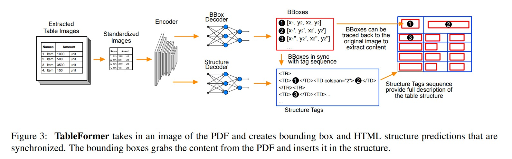
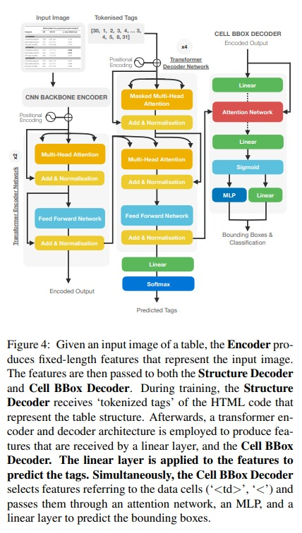

# TableFormer

TableFormer: Table Structure Understanding with Transformers

https://arxiv.org/pdf/2203.01017.pdf

如果是我看到这篇 paper 的话，我会问这么几个问题：
1. 表格数据和 图片、nlp 的 数据本质上有什么区别
2. 表格数据在用规整化 tensor 表达是怎么表达的
3. 在 model 方面，table former 结构是什么
4. table 数据，有哪些数据集
5. task 目标是什么，是给定一个 table 然后做分类？还是啥？

回答：
1. 这里的 table 本质还是一个图片，也就是说，我们还是有 ocr 和1 object detection 类似的处理啊，这些模块
2. 表格数据最适合的表示方式是 tree，但是在输入的 raw data 阶段，是以图片的形式输入给 model
3. 用 tree
4. pubtabnet，synthtabnet
5. task 目标是：首先要对每个 table 的 cell 做预测，这一步是 object detection 的流程。其次是要根据 cell 的预测，然后做表格结构化的预测。比方说，哪些 cell 是同一行，同一列，类似的结构预测问题。评价指标是 tree-editing-distance-score (TEDS)，

## TEDS
teds 评价是将表格结构用树状结构表示，数的 root 节点下有两个 children 节点 thread（表格头）和 tbody（表格体），thread 和 tbody 的 children 节点是 tr（表格行），树的叶子节点是 td（单元格）。每个叶子节点包含三种属性 rowspan（行跨度），colspan（列跨度），content（单元格内容）。采用树的距离来进行两棵树之间相似度的度量，来表示表格之间的相似度的度量。编辑距离
$$
TEDS(T_a,T_b) = 1 - EditDist(T_a, T_b) / max(|T_a|, |T_b|)
$$

数据集有 PubTabNet，论文原文 https://arxiv.org/pdf/1911.10683.pdf，；tableformer 也同样提出了一个 table structure dataset 叫 SynthTabNet

本文要解决的问题是，针对 table 类型的数据输入，设计一种网络模式以及算法来识别出 table 的本身 cell 的组织形式和每个 cell 的内容。传统做法的方式是：
1. 找到每段文字所在的位置，cell 位置
2. 找到每个 cell 之间的 tree model 关系
3. 一阶段的方法通常是 ocr 类的，比如 yolov3，mask-rcnn 等
4. 二阶段问题通常是一个 table-structure decomposition 问题
5. 这篇 paper 主要也 focus 在二阶段，找到了一种 robust 的方法

本文贡献：
1. 提出了 TableFormer，一种基于 transformer 的能够预测 树结构、bbox 的 end-to-end 的方法
2. 在各种 table benchmark dataset 里，tableformer 在表现和性能上都远远领先
3. 构建了 synthtabnet 数据集，其中含有更多样式识别难度更大的 table 数据

整个 paper 的框架流程和细节在 figure 3 和 figure 4 里有

1. 将图片输入到 cnn backbone 中，得到定长 feature
2. feature 加入 position encoding 输入到 2层的 transformer encoder layer
3. encoder 的 output 会同时被送到两个 decoder net 里面：structure decoder 和 cell bbox decoder
4. structure decoder
    1. 在训练的时候，接收到的两个输入分别是 encoder 的1 output 和1 tokenized 的 ground truth tags
    2. 
5. cell bbox decoder
    1. 受到了 detr 的启发
    2. 依然用 object query 来做为 decoder 的输入，这里的 html 语句里一些重要的部分，比如 $<td>$ 和 '<' 这种能表示 html 结构的信号就作为 object query 部分了
    3. 最后对 bbox 分类时，类别会加上“空”

读完这篇 paper，感觉和所能想到的能用的办法，没有什么太大的出入。可能，最大的1创新点在于，如何将 html 语言与预测结构做一个结合。还有就是如何得到 bbox 之后，如何将 bbox 的关系，用 tree model 链接起来。

