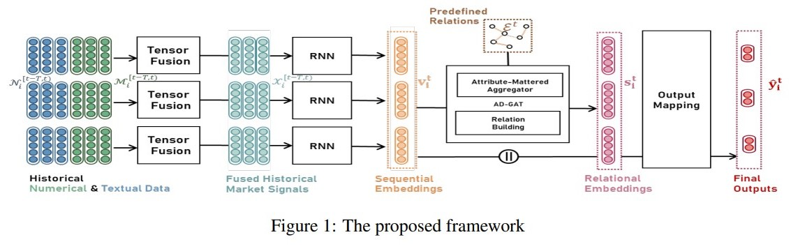

# AD GAT

Modeling the momentum spillover effect for stock prediction via attribute-driven graph attention networks
https://www.aaai.org/AAAI21Papers/AAAI-5328.ChengR.pdf

1. Tensor Fusion model 用来合并 因子数据 和 textual 数据。因子数据也被称为技术数据，textual 数据主要也是
