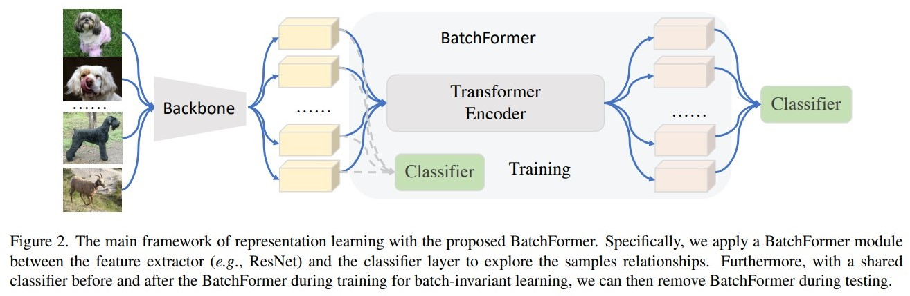

# BatchFormer

BatchFormer: Learning to Explore Sample Relationships for Robust Representation Learning

https://arxiv.org/pdf/2203.01522.pdf

batchformer 是一个即插即用的模块，通过探索样本关系对促进表示学习。比如，下图所示，在 backbone 的 feature extractor 之后直接连接一个 transformer 模块。特别的，将 transformer 沿着 batch dimension，也就是说，我们把batch 看作一个 sequence，在这里，我们移除了 transfoormer 的 positional embedding 以达到位置的不变性学习，与此同时，我们在 transformer 前后都加入了一个分类器，注意，这两个分类器是共享的，通过这个共享的1分类器，使得我们能够保持训练和测试的 batch 不变性。

BatchFormer 可以通过简单的几行代码实现：
~~~python
def BatchFormer(x, y, encoder, is_training):
    # x: input features with the shape [N, C]
    # encoder: TransformerEncoder Layer
    if not is_training:
        return x, y
    pre_x = x
    x = encoder(x.unsqueeze(1)).squeeze(1)
    x = torch.cat([pre_x, x], dim=0)
    y = torch.cat([y, y], dim=0)
    return x, y
~~~

注意到我们 x 的输入一开始是 [N, C] N 是 batchsize C 是 featuresize，
