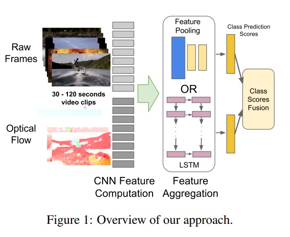
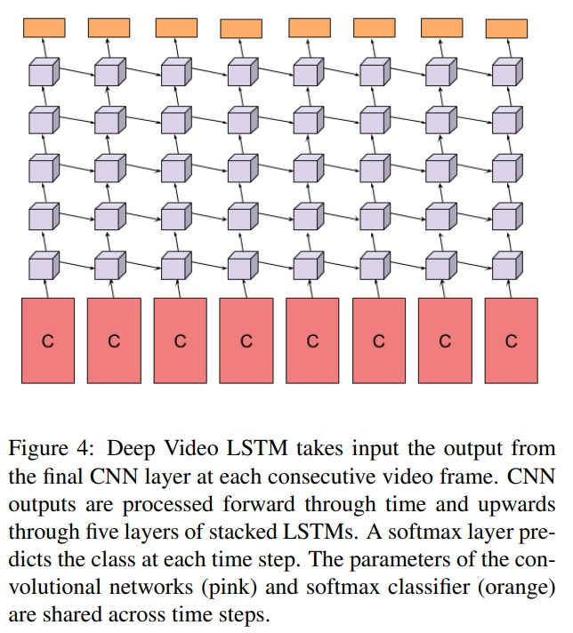

# Beyond Short Snippets

Beyond short snippets: Deep Networks for Video Classification

在 two stream 上的 spatial 的输入，其实都是视频帧其中的一帧。但是上述的做法，其实都是针对比较短的视频；那么如果视频长度拉长，这种就只输入某一帧的原始图像的 rgb 就不太会 work了。

那么，一般来讲，我们都会对这么多的视频帧，先做提取特征的处理。dl 时代之前，就是用手工的特征，比如 sift；dl 时代最正常的想法就是用一个 pretrain 好的 cnn 来提取特征。提取特征之后，要怎么处理？max pooling，avg pooling 还是
 conv pooling？本文还做了很多对比试验，做了 late pooling 和 slow pooling，尝试了 lstm 的特征融合的方式。

如何使用 lstm：
1. c 代表用 cnn 抽取得到的特征，做为 lstm 的时序输入
2. 所有网络权重共享
3. 用了 5 层 lstm 网络来处理 cnn 输出的特征

在 sports-1m 的结果上足了对比。conv pooling 和 lstm 能够使用非常多的帧，而且加上了 optical flow，对比原来的方法有很多提高

ucf-101上，手工特征有 88%，deep video 有 65.4%，双流网络是 88%，这篇工作使用 120帧的 conv pooling也只有 88.2%。所以在 ucf-101 这种短视频数据集上，效果并没有特别好。
1. 原因是：lstm 更多的是抽取语义的特征，对于短视频来说，每一帧的差别并不大，让 lstm 想要学习到一些语义特征比较困难，甚至有可能学到的是无用的噪音。在这种情况下，也可以比较好的理解为什么 lstm 没有带来很大的提高。

