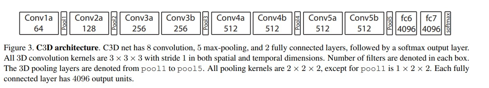
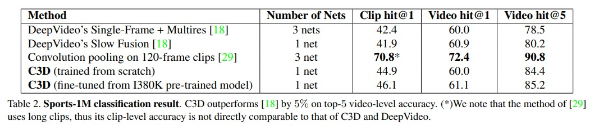
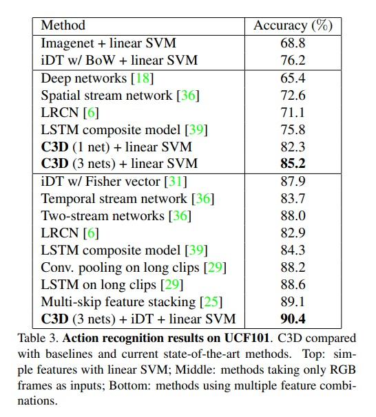

# C3D

ICCV 15

在 two stream 里，optical flow 是非常有用的。但是 optical flow 的计算是非常麻烦的，费时间、费内存、而且 infer 的速度也非常慢。所以，就有了 3d cnn 的出现。3d cnn 在时间域和空间域上是同时建模，那么就没有必要再用光流去特别的代替 temporal 的信息了，大大加速了计算所需要的资源。但是之前的 3d cnn 的效果一直不行，直到本篇的 c3d 的出现。

大体的网络结构其实就是简单的 11 层网络，卷积核将 $(3\times3)$ 变成了 $(3\times3\times3)$，本质实际上就是 3d 的 vggnet，将 vgg 的每一个 block 里减少了一个 conv 层，然后改成了 3d 卷积即可。

模型输入过程：
1. 输入 $(16, 112, 112)$
2. 经过 conv1a 和 pooling $(16, 56, 56)$
3. 经过 conv2a 和 pooling $(8, 28, 28)$
4. 经过 conv3a，conv3b 和 pooling $(4, 14, 14)$
5. 经过 conv4a，conv4b 和 pooling $(2, 7, 7)$
6. 经过 conv5a，conv5b 和 pooling $(4097)$
8. 经过 fc7 $(101)$，最后类别个数就是 ucf-101

从实验结果来看，还是要 3d 比较好。具体结果可以看表的结果。

