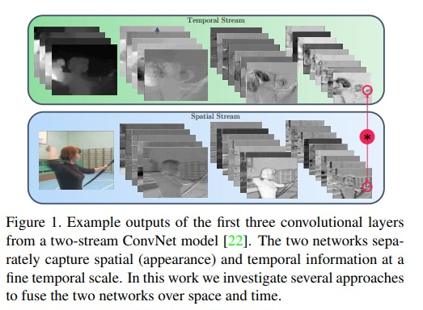
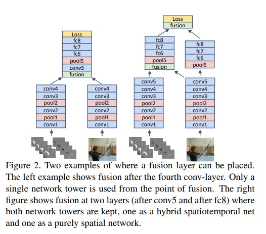
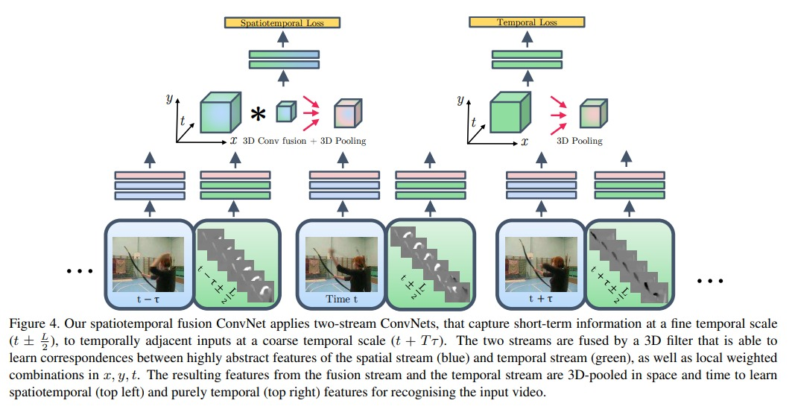

# Convolutional Fusion

这篇文章非常细致的讲解了，怎么去做 feature 的 fusion.

1. 在有了时间流和空间流之后，如何做 fustion？
2. 如何将两个流上的点做 fusion？
3. 在网络的那一层做 fusion？

得到了一个 early fusion 的方法，比 two stream 的 late fusion 效果提高了很多。作者 Christoph 也在本篇 paper 之后一发不可收拾，提出了 SlowFast 和 X3D 的方法，将 3D-CNN 做到了极致。在 video transformer 领域里，他也有 MVit 和 MViTv2 的工作。

什么是 Spatial Fusion？
1. 在有 spatial 和 temporal 的特征下，我们如何保证相同的通道下，他们两个的结果能够有 response？
2. Max Fusion: $y^{max}=f^{max}(x^a,x^b)$
3. Concatenation Fusion：$y^{cat} = f^{cat}(x^a, x^b)$
4. Conv Fusion：$y^{conv}=y^{cat}*f+b$
5. Bilinear Fusion：$y^{bil}=f^{bil}(x^a,b^b)$，也就是做一个 outer product 之后，在做一个加权平均

表现最好的，也就是第四种 conv fusion 的结果

在空间维度上，我们已经知道如何处理特征图了，结论是用 conv fusion。那到底是要在哪一层上做 fusion 呢？偏前面的层 conv1 conv2 还是中间层 conv4 conv5？
1. 第一种方法是，空间流和时间流分别做 conv，在 conv4 的特征的到之后，再做 conv fusion。（和传统意义的 early fusion 很像）
2. 第二种方法是如上图所示，在做到 conv5 之后，将 spatial 信息流加入 temporal 信息流，然后 spatial 信息流继续保持接下来的网络结构。这样 temporal 就在 conv5 之后得到了 spatial 的信息。最后将 这两个特征做 late fusion，得到最后的 softmax 的 prob

最后得到一个总体的框架：
1. 蓝色代表空间流
2. 绿色代表时间流
3. 针对两个流做特侦抽取，到 conv5 之后，采用上述的做法。
4. 具体的融合采用的就是 conv fusion，一个 3d conv fusion 和一个 3d pooling 的做法，送到 fc 层里
5. 最后得到一个结果，算一个 spatial temporal 的 loss
6. temporal 流上，也做一个简单的 pooling，专门做一个针对时间上的1损失函数
7. 最后的分类结果是将上述两个头的 output 做一个平均，和原始的 two stream 的做法一样

实验结果
1. ucf101 和 hmdb51的结果：
    1. two stream 的 backbone 换成了 vgg16，ucf-101 上有 91% 的结果；在 hmdb51 上 58.7% 的结果
    2. 本文结果，ucf-101 有 92.5% 的结果；hmdb51 上有 65.4% 的结果

本文的贡献
1. 做了非常多 ablation study，将几乎所有 fusion 方式都做了对比，得到了结果，能让后来的研究者少走弯路
2. 使用了 3d conv 的网络，让研究者们对之前不太 work 的 3d cnn 更有信心

