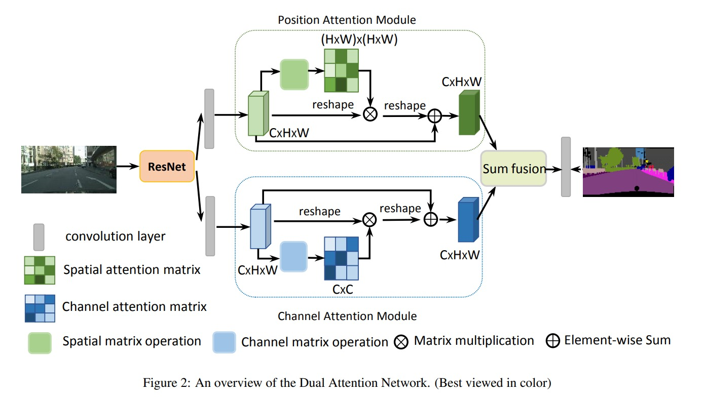

# DANet

Dual Attention Network for Scene Segmentation

https://arxiv.org/pdf/1809.02983.pdf
图像分割不同于图像分类，对于位置、目标尺度、物体多姿态、还有不同环境光照、遮挡等问题，这些都是需要在设计网络的时候需要考虑的。

整个 danet 的 pipeline 如上图所示，整体流程为：
1. 基于 resnet 作为一个 backbone 来提取特征
2. 把提取出来的 feature 送入到 position attention module 和 channel attention module
3. position attention module
    1. 输入维度为 $C\times H\times W$ 做为 position attention module 的输入
    2. 经过三个卷积，的到 B，C，D 的输出，分别维度是 $C_B\times H\times W$,$C_C\times H\times W$,$C_D\times H\times W$
    3. 然后，对 $H,W$ 维度进行reshape，做 B 和 C 的内积，得到一个 $N\times N$ 的矩阵
    4. 内积结果做完 softmax 得到矩阵 S，$S\in{C}$ 和 D 矩阵做矩阵乘然后再加上原始的输入 A
    5. $E_j = \alpha \sum_{i=1}^N (s_{ji}D_i) + A_j$ 其中 $\alpha$ 是可学习参数
4. channel attention module 
    1. channel attention module 和 position attention module 异曲同工
    2. 输入维度是 $C\times H\times W$，先 reshape 到 $C\times N$
    3. 然后1过两个 FC 层，分别得到 attention 的 query 和 key，矩阵乘之后 softmax
    4. softmax 矩阵和 reshape 过之后的矩阵矩阵乘得到 channel attention module 的结果
    5. $E_i = \beta \sum_{i=1}^C (x_{ji} A_i) + A_{j}$
5. position attention module 和 channel attention module 的结果都是 $C\times H\times W\times$，对于 segmentation 的任务我们的 output 确实也应该和 input 的 shape 一样，对齐，所以只需要做一个 late fusion，这里采取的是 sum fusion 然后确定通道数是分类个数即可

DANet在Cityscapes,Pascal VOC2012, Pascal Context和COCO Stuff上取得了杰出的成绩，在未来，作者希望在减少计算复杂度，提高模型的鲁棒性方面有相应的研究

