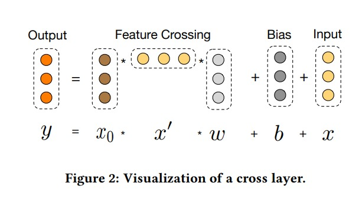

# Deep Cross Network
简称 dcn，也是最原始的 dcn-vector 模型，之后还有 dcn-matrix 和 dcn-mix 等模型

本篇文章的贡献在于，DCN 提出了一种能够高效捕捉特征的高维交互结果的方法
特征学习有三高问题，dcn解决了其中的 1 和 2
1. 高阶，表达三阶以上的显示特征交叉 [√]
2. 高效率：特征交叉模块的预测效率最好是 $O(N)$，其中 $N$ 是特征数量 [√]
3. 高表达能力： 特征交叉模块有足够大的参数容量来捕获各种可能的特征交叉 [×]

FM 提出了一个二次项的特征交互模型。利用向量 $v_i$ 来代表 $x_i$ 来和其他的特征交互。但是涉及到更高的维度，怎么来设计这个交叉项 $x_1^{\alpha_1} x_2^{\alpha_2}...x_d^{\alpha_d}$ 的系数呢？

1. 假设上述交叉项的度数是 $\alpha = \sum_{i=1}^d\alpha_i$
2. 我们的特征 $x = [x_1,...,x_d]\in\mathcal{R}^d$

为了拟合这个多项式的稀疏 $w_\alpha$

假想有一个 l-layer 的 cross network。$x_{i+1}=x_0 x_i^Tw_i+x_i$，这个网络的输入是 $x_0=[x_1,...,x_d]^T$，输出是 $g_l(x_0)=x_l^Tw_l$

~~~python
import torch
import torch. nn as nn 
class CrossNetVector(nn.Module):
    def __init__(self, d_in, n_cross=2):
        super().__init__()
        self.n_cross = n_cross
        self.linears = nn.ModuleList([nn.Linear(d_in,1,bias=False) for i in range(self.n_cross)])
        self.biases = nn.ParameterList(
            [nn.Parameter(torch.zeros(d_in)) for i in range(self.n_cross)])
        
    def forward(self, x):
        x0 = x
        xi = x
        for i in range(self.n_cross):
            xi = x0*self.linears[i](xi)+self.biases[i]+xi
        return xi
~~~

说白了就是，每升高一阶，我们就用 $x_0 \times x' \times w$ 这样的矩阵乘法来模拟 $x_{0i}$ 和 $x_{0j}$ 之间的作用。

有个小问题：如果是 $M$ 阶，对 $N$ 个特征来说，应该有 $C_{N}^N$ 个结果才对，为啥最后的特征还是原来的维度？
