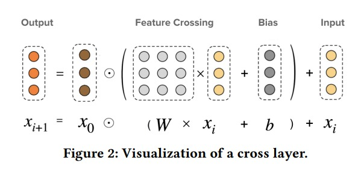

# DCN v2

DCN matrix

DCN-vector，也即最原始的 vector 虽然解决了高阶、高效率。但是他在高表达能力方面有所缺陷1，他仅仅用一个和输入特征等长的1向量来刻画特征之间的相互作用，不足以表述丰富的特征交叉模式。CrossNetVector 的参数数量相比 Deep 部分的 MLP 的参数数量也实在微不足道，可能存在记忆容量瓶颈。换言之，他的权值共享可能做的有些过头了。正是基于这样的洞察，DCN-matrix 在 DCN-vector 基础上做了一些轻微的改动，用矩阵代替了向量，并适配性的修改了一些运算符，强化了显式特征交叉相的表达能力。

~~~python
import torch
import torch.nn as nn
class CrossNetMatrix(nn.Module):
    def __init__(self, d_in, n_cross=2):
        super().__init__()
        self.n_cross = n_cross
        self.linears = nn.ModuleList([nn.Linear(d_in,d_in) for i in range(self.n_cross)])
        
    def forward(self, x):
        x0 = x
        xi = x
        for i in range(self.n_cross):
            xi = x0*self.linears[i](xi)+xi
        return xi
~~~

CrossNetMatrix 用一个 $N\times N$ 的交互矩阵 $W$ 来表示，因为本质上来说，用 vector 来表示特征的一些信息，实在是过于匮乏了。

DCN-Mix 是在 DCN-matrix 基础上提升计算效率，同时保持高表达能力的一种方案
- 矩阵分解：根据 svd 理论，庞大的交互矩阵 $W$ 可以由两个低秩矩阵 U 和 V 的乘积来近似。这样可以将参数量和计算复杂度降低到 N
$$
x_{l+1} = x_0 \odot (U_l(V_l^Tx_i) + b_l) + x_i
$$
- 专家融合：使用两个低秩矩阵 U 和 V 的乘积来近似 W 提升了效率但是降低了表达能力，可以使用 MOE 思想融合多个低秩空间的专家网络来提升表达能力。
$$
x_{l+1} = \sum_{i=1}^K G_i(x_l)E_i(x_l) + x_l \\
E_i(x_l) = x_0 \odot (U_l^i(V_l^{iT}x_l) + b_i)
$$
- 低秩变换：可以在 U 和 V 之间在低秩空间上做一些变换适当再增加表达能力：
$$
E_i(x_l) = x_0\odot (U_l^i g(C_l^i g(V_l^{iT} x_l))+b_l)
$$

DCN-Mix 代码：

~~~python
import torch
import torch.nn as nn
class CrossNetMix(nn.Module):
    def __init__(self, d_in, n_cross =2, low_rank=32, n_experts=4):
        super().__init__()
        self.d_in = d_in
        self.n_cross = n_cross
        self.low_rank = low_rank
        self.n_experts = n_experts

        # U: (d_in, low_rank)
        self.U_list = nn.ParameterList([nn.Parameter(nn.init.xavier_normal_(
            torch.empty(n_experts, d_in, low_rank))) for i in range(self.n_cross)])

        # V: (d_in, low_rank)
        self.V_list = nn.ParameterList([nn.Parameter(nn.init.xavier_normal_(
            torch.empty(n_experts, d_in, low_rank))) for i in range(self.n_cross)])

        # C: (low_rank, low_rank)
        self.C_list = nn.ParameterList([nn.Parameter(nn.init.xavier_normal_(
            torch.empty(n_experts, low_rank, low_rank))) for i in range(self.n_cross)])

        # G: (d_in, 1)
        self.gating = nn.ModuleList([nn.Linear(d_in, 1, bias=False) for i in range(self.n_experts)])

        # Bias 
        self.biases = nn.ParameterList([nn.Parameter(torch.zeros(d_in)) for i in range(self.n_cross)])

    def forward(self, x):
        x0 = x
        xi = x
        for i in range(self.n_cross):
            output_of_experts = []
            gating_score_of_experts = []
            for expert_id in range(self.n_experts):

                # (1) G(xi)
                # compute the gating score by xi
                gating_score_of_experts.append(self.gating[expert_id](xi))

                # (2) E(xi)
                # project the input xi to low_rank space
                v_x = xi@(self.V_list[i][expert_id])   # (batch_size, low_rank)

                # nonlinear activation in low rank space
                v_x = torch.tanh(v_x)
                v_x = v_x@self.C_list[i][expert_id]     # (batch_size, low_rank)
                v_x = torch.tanh(v_x)

                # project back to d_in space
                uv_x = v_x@(self.U_list[i][expert_id].T)  # (batch_size, d_in)
                expert_out = x0*(uv_x + self.biases[i])
                output_of_experts.append(expert_out)

            # (3) mixture of low-rank experts
            output_of_experts = torch.stack(output_of_experts, 2)  # (batch_size, d_in, n_experts)
            gating_score_of_experts = torch.stack(gating_score_of_experts, 1)  # (batch_size, n_experts, 1)
            moe_out = torch.bmm(output_of_experts, gating_score_of_experts.softmax(1))
            xi = torch.squeeze(moe_out) + xi  # (batch_size, d_in)

        return xi
~~~

最后是 dcn 的 pytorch 实现，可以根据不同的类型选择 dcn 模型：

~~~python
import torch 
from torch import nn,Tensor 
import torch.nn.functional as F 

#离散特征编码
class CatEmbeddingSqrt(nn.Module):
    """
    离散特征使用Embedding层编码, d_embed等于sqrt(category)
    输入shape: [batch_size,d_in], 
    输出shape: [batch_size,d_out]
    """
    def __init__(self, categories, d_embed_max = 100):
        super().__init__()
        self.categories = categories
        self.d_embed_list = [min(max(int(x**0.5), 2),d_embed_max) for x in categories]
        self.embedding_list = nn.ModuleList([nn.Embedding(self.categories[i],self.d_embed_list[i])
                            for i in range(len(categories))])
        self.d_cat_sum = sum(self.d_embed_list)
        
    def forward(self, x_cat):
        """
        param x_cat: Long tensor of size ``(batch_size, d_in)``
        """
        x_out = torch.cat([self.embedding_list[i](x_cat[:,i]) 
                           for i in range(len(self.categories)) ],dim=1)
        return x_out
    
#deep部分
class MLP(nn.Module):
    def __init__(self, d_in, d_layers, dropout):
        super().__init__()
        layers = []
        for d in d_layers:
            layers.append(nn.Linear(d_in, d))
            layers.append(nn.BatchNorm1d(d))
            layers.append(nn.ReLU())
            layers.append(nn.Dropout(p=dropout))
            d_in = d
        self.mlp = nn.Sequential(*layers)

    def forward(self, x):
        return self.mlp(x)
    

#3种CrossNet的实现    
class CrossNetVector(nn.Module):
    def __init__(self, d_in, n_cross=2):
        super().__init__()
        self.n_cross = n_cross
        self.linears = nn.ModuleList([nn.Linear(d_in,1,bias=False) for i in range(self.n_cross)])
        self.biases = nn.ParameterList(
            [nn.Parameter(torch.zeros(d_in)) for i in range(self.n_cross)])
        
    def forward(self, x):
        x0 = x
        xi = x
        for i in range(self.n_cross):
            xi = x0*self.linears[i](xi)+self.biases[i]+xi
        return xi
    
    
class CrossNetMatrix(nn.Module):
    def __init__(self, d_in, n_cross=2):
        super().__init__()
        self.n_cross = n_cross
        self.linears = nn.ModuleList([nn.Linear(d_in,d_in) for i in range(self.n_cross)])
        
    def forward(self, x):
        x0 = x
        xi = x
        for i in range(self.n_cross):
            xi = x0*self.linears[i](xi)+xi
        return xi
    

class CrossNetMix(nn.Module):
    def __init__(self, d_in, n_cross =2, low_rank=32, n_experts=4):
        super().__init__()
        self.d_in = d_in
        self.n_cross = n_cross
        self.low_rank = low_rank
        self.n_experts = n_experts

        # U: (d_in, low_rank)
        self.U_list = nn.ParameterList([nn.Parameter(nn.init.xavier_normal_(
            torch.empty(n_experts, d_in, low_rank))) for i in range(self.n_cross)])
        
        # V: (d_in, low_rank)
        self.V_list = nn.ParameterList([nn.Parameter(nn.init.xavier_normal_(
            torch.empty(n_experts, d_in, low_rank))) for i in range(self.n_cross)])
        
        # C: (low_rank, low_rank)
        self.C_list = nn.ParameterList([nn.Parameter(nn.init.xavier_normal_(
            torch.empty(n_experts, low_rank, low_rank))) for i in range(self.n_cross)])
        
        # G: (d_in, 1)
        self.gating = nn.ModuleList([nn.Linear(d_in, 1, bias=False) for i in range(self.n_experts)])

        # Bias 
        self.biases = nn.ParameterList([nn.Parameter(torch.zeros(d_in)) for i in range(self.n_cross)])
        

    def forward(self, x):
        x0 = x
        xi = x
        for i in range(self.n_cross):
            output_of_experts = []
            gating_score_of_experts = []
            for expert_id in range(self.n_experts):
                
                # (1) G(xi)
                # compute the gating score by xi
                gating_score_of_experts.append(self.gating[expert_id](xi))

                # (2) E(xi)
                # project the input xi to low_rank space
                v_x = xi@(self.V_list[i][expert_id])   # (batch_size, low_rank)

                # nonlinear activation in low rank space
                v_x = torch.tanh(v_x)
                v_x = v_x@self.C_list[i][expert_id]     # (batch_size, low_rank)
                v_x = torch.tanh(v_x)

                # project back to d_in space
                uv_x = v_x@(self.U_list[i][expert_id].T)  # (batch_size, d_in)
                expert_out = x0*(uv_x + self.biases[i])
                output_of_experts.append(expert_out)

            # (3) mixture of low-rank experts
            output_of_experts = torch.stack(output_of_experts, 2)  # (batch_size, d_in, n_experts)
            gating_score_of_experts = torch.stack(gating_score_of_experts, 1)  # (batch_size, n_experts, 1)
            moe_out = torch.bmm(output_of_experts, gating_score_of_experts.softmax(1))
            xi = torch.squeeze(moe_out) + xi  # (batch_size, d_in)
            
        return xi
    
    
class DeepCross(nn.Module):
    """
    DeepCross三种模型(DCN-vec,DCN-matrix,DCN-mix)的统一实现。
    """

    def __init__(self, d_numerical, categories, d_embed_max = 8,
                 n_cross=2, cross_type = "matrix", low_rank=32, n_experts=4, 
                 mlp_layers = [128,64,32] ,mlp_dropout = 0.25, 
                 stacked = True, 
                 n_classes = 1):
        
        super().__init__()
        
        if cross_type=='mix':
            assert low_rank is not None and n_experts is not None
        
        if d_numerical is None:
            d_numerical = 0
        if categories is None:
            categories = []
            
        self.categories = categories
        self.n_classes = n_classes
        self.stacked = stacked
        
        
        self.cat_embedding = CatEmbeddingSqrt(categories, d_embed_max) if categories else None
        
        self.d_in = d_numerical 
        if self.cat_embedding:
            self.d_in+=self.cat_embedding.d_cat_sum
            
        if cross_type=="vector":
            self.cross_layer = CrossNetVector(self.d_in,n_cross)
        elif cross_type=="matrix":
            self.cross_layer = CrossNetMatrix(self.d_in,n_cross)
        elif cross_type=="mix":
            self.cross_layer = CrossNetMix(self.d_in,n_cross,low_rank,n_experts)
        else:
            raise NotImplementedError("cross_type should  be one of ('vector','matrix','mix') !")
        
        self.mlp = MLP(
            d_in= self.d_in,
            d_layers = mlp_layers,
            dropout = mlp_dropout
        )
        
        if self.stacked:
            self.last_linear = nn.Linear(mlp_layers[-1],n_classes)
        else:
            self.last_linear = nn.Linear(self.d_in+mlp_layers[-1],n_classes)
        

    def forward(self, x):
        
        """
        x_num: numerical features
        x_cat: category features
        """
        x_num,x_cat = x
        
        #embedding 
        x_total = []
        if x_num is not None:
            x_total.append(x_num)
        if self.cat_embedding is not None:
            x_total.append(self.cat_embedding(x_cat))
        x_total = torch.cat(x_total, dim=-1)
        
        
        #cross部分
        x_cross = self.cross_layer(x_total)
        
        
        #deep部分
        if self.stacked:
            x_deep = self.mlp(x_cross)
            x_out = self.last_linear(x_deep)
        else:
            x_deep = self.mlp(x_total)
            x_deep_cross = torch.cat([x_deep,x_cross],axis = 1)
            x_out = self.last_linear(x_deep_cross)
            
        if self.n_classes==1:
            x_out = x_out.squeeze(-1)
        
        return x_out 

##测试 DeepCross

x_num = torch.randn(2,3)
x_cat = torch.randint(0,2,(2,3))

dcn_vec = DeepCross(d_numerical = 3, categories = [4,3,2], d_embed_max = 4,
        n_cross=2, cross_type = "vector", 
        mlp_layers = [20,20], mlp_dropout=0.25,
        stacked = False,
        n_classes = 1)

dcn_matrix = DeepCross(d_numerical = 3, categories = [4,3,2], d_embed_max = 4,
        n_cross=2, cross_type = "matrix", 
        mlp_layers = [20,20], mlp_dropout=0.25,
        stacked = True,
        n_classes = 1)

dcn_mix = DeepCross(d_numerical = 3, categories = [4,3,2], d_embed_max = 4,
        n_cross=2, cross_type = "mix", low_rank=32, n_experts=4, 
        mlp_layers = [20,20], mlp_dropout=0.25,
        stacked = False,
        n_classes = 1)

print(dcn_vec((x_num,x_cat)))
print(dcn_matrix((x_num,x_cat)))
print(dcn_mix((x_num,x_cat)))
~~~

