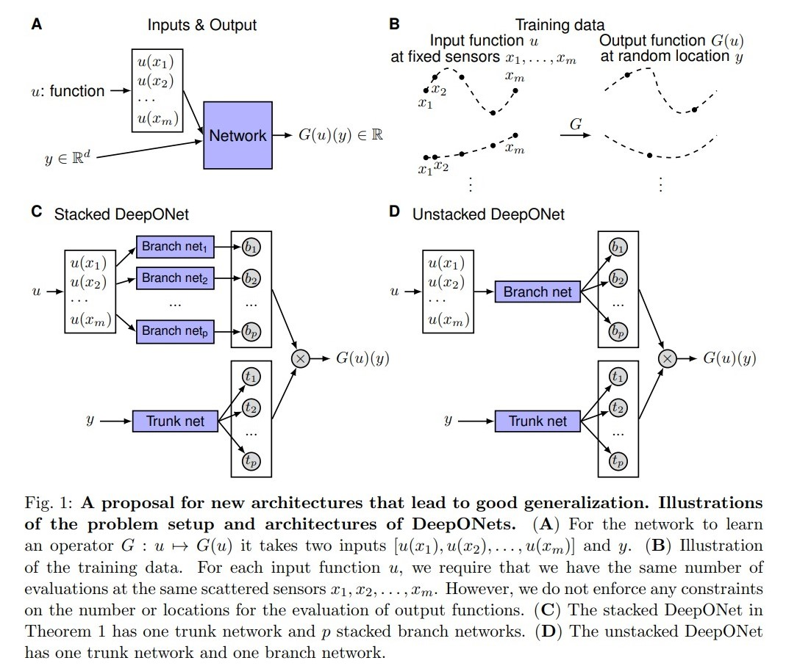

# DeepONet

https://arxiv.org/pdf/1910.03193v2.pdf
Learning nonlinear operators via DeepONet based on the universal approximation theorem of operators

## 算子学习方法
假设我们有一个算子 $G$，有一个函数是 $u$，那么该函数通过这个算子 $G$ 的到的一个输出函数是 $G(u)$。对于 $G(u)$ 的定义域里面的任一一个点 $y$，我们可以得到一个实数结果 $G(u)(y)$。所以我们的神经网络需要有的输入是两个，分别是 $u$ 和 $y$。这层 nn 本质上要做的事情就是去拟合一个算子 $G$，那么我们会尝试不同的输入函数。

表达一个函数的方法有很多，比如图1中的，用有限多的 sensor 去近似得到函数的输出值。或者，用 spectral expansion，用 image 表达等等。这里 sensor 的含义本质上就是一个采样器，

特别的，我们验证了，我们可以设计 nn 使得他们可以现实的表达一些算子，比如 积分、变形、除法微分、拉普拉斯变换，甚至是 pde 的方程等等。nn 强大的拟合能力可以十分准确地预测一个算子的行为，或者去预测一个 dynamic system 的解

## 定理1 Universal Approximation Theorem for Operator
假设 $\sigma$ 是一个连续的非多项式函数，$X$ 是一个巴拿赫空间（泛函分析里具有范数而且对范数完备的向量空间），$K_1\subset X, K_2\subset R^d$ 是两个紧集，$V$ 也是一个紧集在 $C(K_1)$，$G$ 是一个非线性的连续算子，$G$ 是一个从 $V$ 到 $C(K_2)$ 的映射。那么，对于任意的 $\epsilon > 0$，一定同时存在 $n, p, m$ 和常数 $c_i^k,\xi_{ij}^k,\theta_i^k,\zeta_i^k\in R,w_k\in R^d,x_j\in X_1,i=1,...,n,k=1,...,p,j=1,...,m$ 使得：
$$
|G(u)(y) - \sum_{k=1}^p\sum_{i=1}^n c_i^k\sigma(\sum_{j=1}^m\xi_{ij}^ku(x_j)+\theta^k_i)\sigma(w_k \cdot y+ \zeta_k)| < \epsilon
$$
其中，左边带求和项的那一大堆是被称为 branch，右边的 $\sigma(w_k \cdot y + \zeta_k)0 $ 被称为 trunk。定理1的存在保证了，我们可以利用 nn 去根据生成的数据去拟合任一一个非线性算子。最终的loss 可以被拆分成三个部分，分别是 approximation，optimization和generalization error

fig1 解释
1. 图一其实就是有某一个function u 和他的sensor x以及对应的输入y
2. 图二是不同的function u和fixed sensor x
3. 图三是stack 版本的 deeponet
4. 图四是unstack 版本的deeponet

## 数据生成
我们考虑一个 ode system
$$
\frac{d}{dx}s(x) = g(s(x), u(x), x) \\
s(a) = s_0
$$
其中，函数 u 是一个定义在 $[a, b]$ 的连续函数，$G$ 是一个算子
$$
G(u)(x) = s_0 + \int_a^x g(G(u)(t), u(t), t) dt
$$
然后我们等间距的取 $m+1$ 个点 $x_j = a + j(b-1)/m$，以及定义函数 $u_m(x)$：
$$
u_m(x) = u(x_j) + \frac{u(x_{j+1}) - u(x_j)}{x_{j+1} - x_j} (x- x_j), x_j\leq x\leq x_{j+1}
$$
相当于是一个分段函数吧，假设函数 $u$ 到函数 $u_m$ 的映射是 $L_m$，

