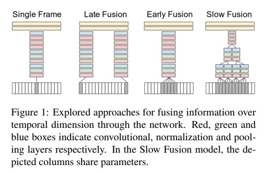
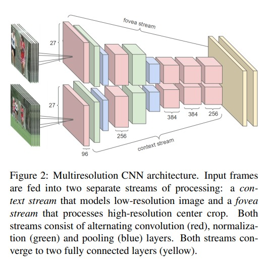

# DeepVideo

自从 alexnet 之后，video 方向的工作，慢慢的都从手工的特征转为了 cnn 的方法，这篇论文就是 cvpr 2014 的工作。在这篇工作之前，也有 nn 的工作的，但是数据集都比较小，而且网络层数比较深。所以这篇论文可以认为是，深度学习时代，最早期的工作。

本质来说就是，视频比图像多了一维时间维度，所以我们有很多可以尝试的模块组合

1. single frame 方式就是图片分类的方式，完全没有时间信息和视频信息在里面。
2. late fusion 是指在网络输出层面进行融合，输入时还是正常的共享参数权重，最后得到 prob 的结果。
3. early fusion 是指在进入网络之前，就将若干视频帧合并在了一起做了 concat，然后得到 prob 的结果。
4. slow fusion 是指在特征层面上不停的进行融合。结果最好

但是最后从结果上来看，差别并不大。而且在 ucf-101 数据集上比不上手工数据集。

于是作者进行了尝试，叫做 multi resolution cnn，多分辨率卷积神经网络。输入分成了两个部分，一部分是原图 context stream，另外一部分是抠出来了一部分的范围 fovea stream。想要既能学到整个图片的理解信息和部分信息的网络。但是两个网络是全局共享的，想要强制性的关注某些区域。mrcnn 确实有一定提高，但是提升结果有限。

结果：在 sports-1m 上：
1. early fusion 不如 single frame baseline
2. late fusion 也不如 single frame baseline 
3. slow fusion 勉强比 single frame baseline 高一点

结果：在 ucf-101 上：
1. 作者这里最好的变体只有 65.4% 的准确率
2. 手工特征是 87% 的准确率。
3. 完全不如手工特征的结果，引发了很多的思考

但是：
1. 提出了最大的视频数据集 sports-1m
2. 尝试了各种可以尝试的增加效果 trick baseline 方法，给以后的工作提供了可参考的结果
3. 影响力巨大

