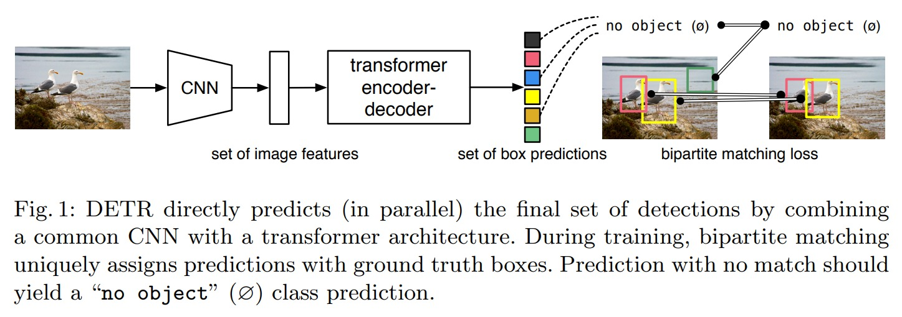
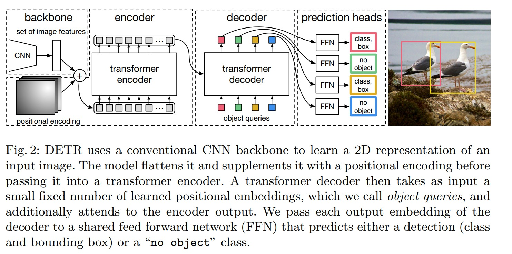
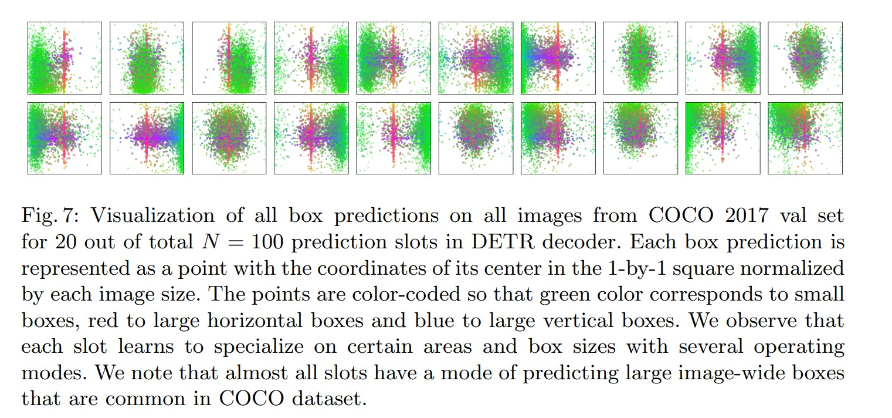

# DETR

detection transformer，端到端的 transformer 目标检测。

## 摘要
目标检测，本质就是集合预测。做出了端到端的方法，消除了 nms 的后处理。detr 提出了一个新的目标函数，用二分图的匹配方式，就不会生成那么多冗余的框了；其次采用了 transformer 的 encoder-decoder 结构，在解码的时候，用 learned object query 和全局图像信息，不停的做 attention 来做预测框（并行出框速度快，不需要先后顺序，也不需要自回归）。在 coco 上的效果并不是特别好，但是在全景分割任务上有非常好的效果。

1. proposal based 的工作：faster rcnn，mask r-cnn，cascade r-cnn
2. anchor based 的工作：yolo，focal loss
3. non anchar based 的工作：centernet，fcos
4. 简化 nms 的工作：learnable nms，soft nms

以上都没有直接做集合预测的任务，而是用替代的比如说回归、分类等任务去替换，而且他们的方法都会生成冗余框，很依赖于 nms 来抑制。

detr 的 pipeline 大概就是 
1. 图片经过 cnn 提取特征
2. 过 transformer encoder学全局特征
3. 经过 decoder 得到若干 bbox 预测
4. 用二部图匹配。框的个数，是固定的，设置好的，对和 gt 的 bbox 做 matching loss，做完匹配之后，才会算回归和分类任务。

推理的时候：
1. 前三步和之前一致
2. 只有第四步的时候，不需要 matching loss，用一个阈值去卡置信度，那么直接输出高于阈值的 bbox 即可（只需要调阈值，比原来的方法调参的过程少了很多）

detr 对大物体的 ap 比较好，可能因为是有全局的信息；但是小物体的 ap 比较差。deformable detr 解决了小物体的问题。

## 相关工作

set-based loss：learnable nms的方法，都是利用 attention 的方法，获取一种独一无二的预测方法，但是性能比较差。为了增加性能，手工增加了一些特征。Recurrent detectors：目标检测、实例分割，都有，但是工作都比较早，都是 rnn 的形式；detr 用的则是 transformer encoder-decoder 不带掩码机制，然后来做 parallel 的解码。

## 模型方法

object detection set prediction loss：首先，任何一张图片输入，都有固定为 N=100 个 bbox 的输出（N一般大于数据集里最多的物体数目）。这里就用了二分图匹配的问题（说白了就是有 n 个 source 和 m 个 target，如何能最好的匹配）这里 cost matrix 的数值就是两个框的 loss function，分类的 ce loss 和 框的回归的 loss。但是这里要注意取值范围，分类和回归的 loss 要数值上差不多。然后 回归的 loss 不只是要用 l1 loss，而且还要用 iou loss（前者会比较趋向于出大框）

forward 过程
1. 输入图片大小 $(3, 800, 1066)$
2. 经过 cnn 提取到 $(2048, 25, 34)$ 的特征
3. 经过 $(1\times1)$ 的降维操作得到 $(256, 25, 34)$ 的特征
4. 加入 position encoding $(256, 25, 34)$ 的位置信息
5. transformer 的输入即为 $(860, 256)$ 的输入，850 是序列长度
6. 使用了 6 个 transformer encoder 最后得到 $(850, 256)$ 的输出
7. object query 是 learnable 的 position embedding，维度是 $(100, 256)$，后者是为了和上面输出的 256 进行对齐
8. encoder 的输出 和 object query 进行 decode，得到 $(100, 256)$ 的输出，同样是 6 层 decoder。
9. 检测头，也即 ffn，mlp，做物体类别的预测和 bbox 回归的预测
10. 用匈牙利算法，获取最好的匹配，然后得到 loss，进行 bp

细节：在 decoder 里，object queries 会做自注意力机制，为了移除冗余框。算 loss 的时候，为了收敛更快、更稳定，加了很多 auxiliary loss，来帮助训练。代码简单直白

~~~python
import torch
from torch import nn
from torchvision.models import resnet50

class DETR(nn.Module):
    def __init__(self, num_classes, hidden_dim, nheads,
    num_encoder_layers, num_decoder_layers):
        super().__init__()
        # We take only convolutional layers from ResNet-50 model
        self.backbone = nn.Sequential(*list(resnet50(pretrained=True).children())[:-2])
        self.conv = nn.Conv2d(2048, hidden_dim, 1)
        self.transformer = nn.Transformer(hidden_dim, nheads,
        num_encoder_layers, num_decoder_layers)
        self.linear_class = nn.Linear(hidden_dim, num_classes + 1)
        self.linear_bbox = nn.Linear(hidden_dim, 4)
        self.query_pos = nn.Parameter(torch.rand(100, hidden_dim))
        self.row_embed = nn.Parameter(torch.rand(50, hidden_dim // 2))
        self.col_embed = nn.Parameter(torch.rand(50, hidden_dim // 2))

    def forward(self, inputs):
        x = self.backbone(inputs)
        h = self.conv(x)
        H, W = h.shape[-2:]
        pos = torch.cat([
        self.col_embed[:W].unsqueeze(0).repeat(H, 1, 1),
        self.row_embed[:H].unsqueeze(1).repeat(1, W, 1),
        ], dim=-1).flatten(0, 1).unsqueeze(1)
        h = self.transformer(pos + h.flatten(2).permute(2, 0, 1),
        self.query_pos.unsqueeze(1))
        return self.linear_class(h), self.linear_bbox(h).sigmoid()

detr = DETR(num_classes=91, hidden_dim=256, nheads=8, num_encoder_layers=6, num_decoder_layers=6)
detr.eval()
inputs = torch.randn(1, 3, 800, 1200)
logits, bboxes = detr(inputs)
~~~

## 实验部分

和 fast rcnn 对比，参数量比 faster rcnn 少很多，detr 高了两个点。resnet 做为 backbone gflops 一样，但 fps detr 慢了很多。然后在 小物体而言，faster rcnn 比 detr 高 4 个 ap。作者分析就是，用全局建模，对大物体很友好。detr 没有用 fpn，也没有用 hierarchical 的方法，所以对小物体没有太多信息上的提取。

transformer 的层数越深，得到的 ap 效果越好，但是 fps 和 gflops 越低。

encoder 在学全局的特征，尽量把物体分开；decoder 是把注意力分到去学习边缘上。

还有 object queries 全部可视化出来。看看 object queries 到底学了什么，object queries 其实就是一个可以学习的 bbox，最后学习到了一个不同 anchar 的一些东西。绿色代表小的 bbiox，红色代表大的，横向的 bbox，蓝色代表竖向的 bbox。对于左上的图片，其实就是主要看左下角的一些小的物体，有没有存在。不同的 object queries 侧重于不同大小的 bbox 还有不同区域的，这样来和 anchor 非常像。

