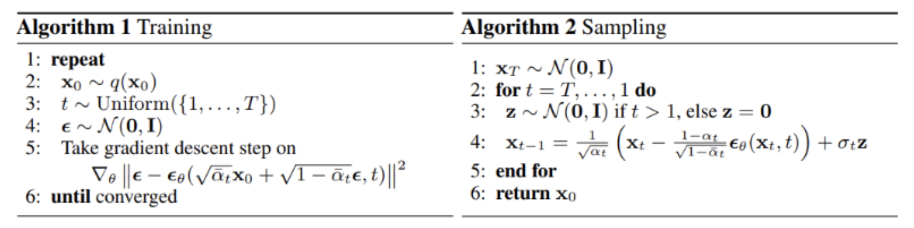

# Diffusion

Denoising Diffusion Probabilistic Models

https://arxiv.org/abs/2006.11239

这篇 markdown 主要介绍和总结 diffusion model 的应用。

本质就是，学习两个映射，图片空间到全空间（扩散过程，通过加噪声），从全空间映射到图片空间（逆扩散过程，去除噪声）。如何生成图片，在全空间中sample一个点，然后跑逆扩散过程，恢复成一个图片。

**扩散过程**

也即，往图片加上噪声的过程。给定图片 $x_0$，前向 T 次雷击对其添加高斯噪声，得到 $x_1,x_2,...,x_T$，前向过程是马尔可夫过程（$\beta_t$ 是常量）
$$
q(x_t|x_{t-1}) = \mathcal N(x_t;\sqrt{1-\beta_t}x_{t-1},\beta_t\mathbf I)\\
q(x_{1:T}|x_0)=\Pi_{t=1}^Tq(x_t|x_{t-1}) = \Pi^T_{t-1}\mathcal N(x_t;\sqrt{1-\beta_t}x_{t-1}, \beta_t I)
$$
**逆扩散过程**

从标准高斯分布 $\mathcal N(0,\mathbf I)$ 还原出样本数据的分布 $x_0$ ，从纯高斯噪声 $p(x_T) := \mathcal N(x_T;0,\mathbf I)$ 开始，模型将学习联合概率分布 $p_\theta(x_{T:0})$  
$$
p_\theta(x_T:0) := p(x_T)\Pi^T_{t=1}p_\theta(x_{t-1}|x_t)\\
=p(x_t)\Pi_{t=1}^T\mathcal N(x_{t-1};\mu_\theta(x_t,t),\Sigma_\theta(x_t,t))
$$
（网络需要学习的就是均值和方差，以此来去除噪声，重构图片；去噪的过程就是生成数据的过程）

---

损失函数
$$
||u-\epsilon_\theta(\bar \alpha_tx_0 + \bar\beta_tu,t)||_2^2
$$

超参数设置 $\alpha_t = \sqrt{1 - 0.02t/T}$

---

重参数 reparameterization trick，背景采样操作不可微，无法通过反向传播来更新提督，从而让模型学习这些分布参数。reparam trick 提出将采样操作变成确定性函数（线性变换）将 $\mathcal N(0,\mathbf I)$ 变成 $\mathcal N(\mu, \sigma^2)$ 详细参考 vae 篇章里的 $\mu$ 和 $\sigma$ 的估计（一个 linear 层就解决的事情）

---

后验条件高斯分布的一些结论，后验条件高斯分布的均值只和超参数 $x_t, \epsilon_t$ 有关，可以得到 $q(x_{t-1}|x_t, x_0)$ 的解析形式

---

代码实现

~~~python
num_steps = 1000
beta = torch.tensor(np.linspace(1e-5, 0.2e-2, num_steps))

alphas = 1 - betas
alphas_prod = torch.cumprod(alphas, 0)
alphas_prod_p = torch.cat([torch.tensor([1]).float(), alphas_prod[:-1]], 0)
alphas_bar_sqrt = torch.sqrt(alphas_prod)
one_minus_alpha_bar_log = torch.log(1 - alphas_prod)
one_minus_alpha_bar_sqrt = torch.sqrt(1 - alphas_prod)

def q_x(x_0, t, noise = None):
  if not noise:
    noise = torch.randn_like(x_0)
  alphas_t = extract(alphas_bar_sqrt, t, x_0)
  alphas_1_m_t = extract(one_minus_alphas_bar_sqrt, t, x_0)
  return (alphas_t * x_0 + alphas_1_m_t * noise)

~~~

---

训练、测试 伪代码

训练：

- 从标准高斯分布采样一个噪声
- 通过梯度下降最小化损失函数
- 训练到收敛为止（训练时间 T 设置为 1000）

测试

- 从标准高斯分布采样一个噪声 $x_T \backsim \mathcal N(0, \mathbf I)$ 
- 从时间 T 开始正向扩散迭代到时间步 1
- 如果时间不为 1，则从标准高斯分布采样 z
- 根据高斯分布计算每个时间步 t 的噪声图

