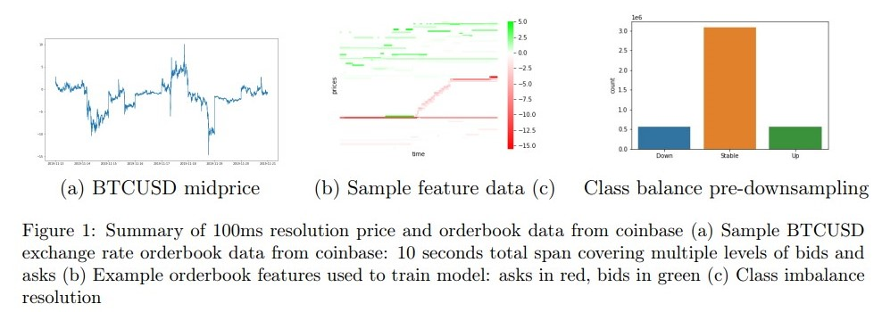

# Deep Learning for Digital Asset Limit Order Books

Introduction: 本篇论文主要讨论的是对于数字货币的 lob 的建模讨论，digital asset 的 lob 往往会比正常的金融资产包含更加复杂的规律，本篇 paper 就是想要利用 deep learning 去预测 crpytocurrency limit order book 的 dynamics。之前的一些 machine learning 的方法一般是：bayesian neural networks，gradien boosting decision trees，lstm 等等。更甚者还有用 ARIMA 模型的。但是对于 cryptocurrency 的 high volatility 来说，risk management 是更加重要的。Sirignano 介绍了一种 spatial neural network 作为一种 low-dimensional means 以及、基于现在的 lob 的状态然后来预测未来的 lob 的状态 （CNN with limit order book data for stock price prediction）

Methodology: 
1. orderbook and mid price data:
    1. data: 由 100ms 的 snapshots 和 深度为 50 的 9个连续日，从2019.06.12 - 2019.06.20
    2. Features: 深度为 50 的 bid ask 的 price volume，总共 200 个 features
2. 数据处理
    1. price 和 volume 这种不同 asset 非常不一样的数据，我们首先需要归一化。$x_{norm} = \frac{x - \hat x}{\sigma_x}$ 
3. 价格变动：
    1. 主要的价格变动都是由前 10 档的 ask 和 bid 造成的。所以对于后 40 档的数据，我们没有必要增加这么多计算量而只得到一些 marginal 的 提升
4. mid price movement predict:
    1. mid price 定义：$p_t = (p_a(t) + p_b(t)) / 2$，其中 $p_a$ 和 $p_b$ 就是 t 时刻的 best ask 和 best bid 价格
    2. k-averaged midprices $m_{-/+}$ 为：$m_-(t)=\frac{1}{k}\sum_{i=0}^{k-1}p_{t-i}$ 和 $m_+(t) = \frac{1}{k}\sum_{i=1}^k p_{t+i}$ 这俩就代表着，在 t 时刻过去（-）若干时刻的均值和 t 时刻 未来 （+）若干时刻的均值。
    3. signed movement $\{t-k, ...,t=1. t\}$ 和 $\{t+1, t+2, ..., t+k\}$
    4. $l_t = 1 \text{if } m_-(t) > m_+(t)(1+\alpha)$
    5. $l_t = -1 \text{if } m_-(t) < m_+(t)(1 - \alpha)$
    6. 0 otherwise

Model Architecture
1. Temporal Convolution Neural Networks for time series predition.
    1. The padding for convolutions are causal. This prevents any informatino leakage from future to past. cnn 的填充不会有 forward looking 的问题
    2. 这种 Architecture 的输入是 sequence of any length 输出也可以是 same length，也就是说，可以得到 orderbook 的盘口预测（当前时刻到下一时刻）
    3. 使用 TCN 而不使用 GRU 和 LSTM 的原因是因为 TCN 对于 memory 的要求、计算的并行性、receptive field 的调整
    4. use kernel size of 2 and calculated a dilation number of 6 from the relation $timessteps = 1 + 2(kernel size - 1)(2^{dilation number} - 1)$

