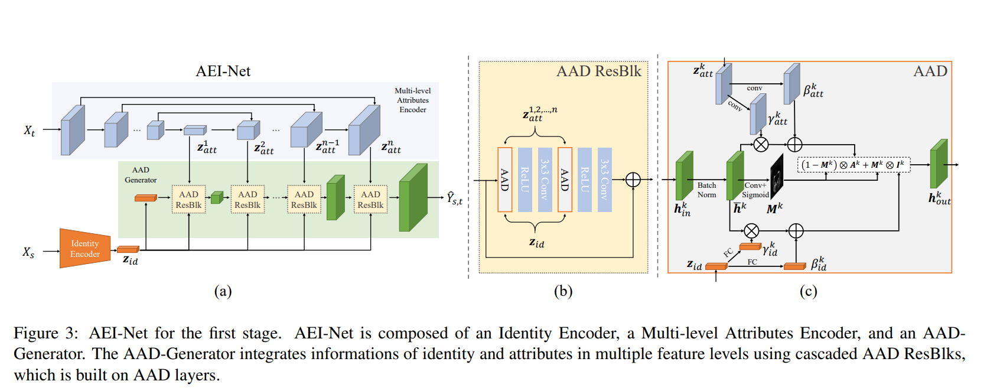

# Faceshifter
keywards: [face_swapping][GAN]

### Introduction
在 face swapping 领域最大的难点在于如何提取和自适应的选取两张融合图片的图片属性和脸部特点。最早期来说，replacement-based 方法是简单的识别出脸部区域然后做脸部替换，这种方法对于 posture 和 perspective 非常敏感，而且对背景线等场景没有做到融合。3D-based 的方法会利用 3D 模型来处理 posture 和 perspective difference的变换，但是也同样在变换结果上不尽人意。最近兴起的 GAN-based 的方法生成的结果有令人深刻的好的 performance。

FaceShifter 整篇 paper 主要描述了 GAN-based network，叫 Adaptive Embedding Integration Network(AEI-Net)。AEI-Net 主要做了以下两点改进：1. 用 multi-level attributes encoder 去提取目标的特征；RSGAN 和 IPGAN 里面只把输入图片 encode 成一个 single vector。2. 在 GAN 的 generator 里面，使用了一个 Adaptive Attentional Denormalization (AAD) layer 去提取 attributes 和 identity embeddings 的信息。3. 在训练阶段，生成网络的 target 和 source 为同一张图片得到的结果偏离原本的图片很多，所以采用了 Heuristic Error Acknowledging Refinement Network (HEAR-Net) 去调整姿态和 reconstruction error

### Related Work
3D-based Approaches: **3DMM**, **Face2Face**,
GAN-based Approches: **DeepFakes**, **CageNet**, **RSGAN**, **FSNet**, **IPGAN**, **FSGAN**

### Method
符号定义：  
$\hat{Y}_{s,t}$ generator 输出，高保真度输出  
$X_s$ source image，用来提供人脸的图片 
$X_t$ target image，用来提供替换人脸的图片  
$z_{id}(X_s)$ identity encoder，用来提取 source image 里人脸的特征信息  
$z_{att}(X_t)$ multi-level attributes encoder，用来提取 target image 的不同维度的 feature 信息  

网络结构说明： 
1. 对于上层的 encoder-decoder like 的结构，一般采用 unet 这种 segmentation model 的 backbone 网络
2. AAD 模块本质上来说就是一个融合模块，选择用 source source 产生的 id vector 还是用 target image 的背景来融合的一种 attention mask 的方法
3. $\gamma$ 和 $\beta$ 分别是由 conv 或者 fc 生成的 mask scale 和 bias。用来生成 $A^k = \gamma_{att}\otimes\bar{h}^k + \beta_{att}^k$ 以及 $I^k=\gamma_{id}^k\otimes\bar{h}^k+\beta_{id}^k$
4. 最后由上一层 layer 的输出 $h_k$ 由 conv 和 sigmoid 最后确定当前的 mask $M^k$
5. 计算得到 AAD Layer 的最终输出 $h_{out}^k = (1 - M^k)\otimes A^k + M^k\otimes I^k$ 

Training Loss  
1) adversarial loss，用来 train GAN 的 adv loss  
$\mathcal{L}=1, \text{if recognized the Y is real or fake}$
2) id loss，用来拉近生成出来的 $\hat{Y}_{s,t}$ 和 $X_s$ 的距离 
$\mathcal{L}_{id}=1 - cos(z_{id}(\hat{Y}_{s,t}), z_{id}(X_s)$  
3) attributed loss，用来维持图像风格上的一致性，在 encoder 的每一层都会设置一个 l2 loss 去限制范数  
$\mathcal{L}_{att}=\frac{1}{2}\sum_{k=1}^n||z_{att}^k(\hat{Y}_{s,t}) - z_{att}^k(X_t)||_2^2$
4) reconstruction loss，当 target image 和 source image 是同一张图片时，我们要求 generator 能够复现出来 image，也即要有更小的 l2 loss  
$\mathcal{L}_{rec} = \frac{1}{2}||\hat{Y}_{s,t}-X_t||_2^2, \text{if } X_t=X_s$
5) 总的 AEI-Net 的 loss 定义为上述鸡哥loss的加强相加  
$\mathcal{L}_{AEI-NET}=\mathcal{L}_{adv} + \lambda_{att}\mathcal{L}_{att} + \lambda_{id}\mathcal{L}_{id}+\lambda_{rec}\mathcal{L}_{rec}$  
超参数分别为 10， 10， 5

Heuristic Error Acknowledge Refinement  
为了解决一些 image blurring 的问题，需要做refinement。把生成图片的残差也作为输入再输入进去最后也是相同的 pipeline 来做自监督的回归。

