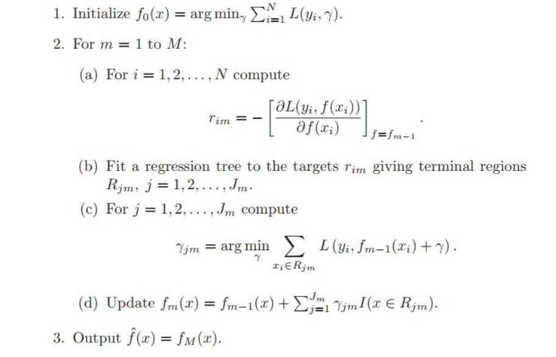

# GBDT

全称 Gradient Boosting Deision Tree，梯度提升决策树

对于任何分类、回归、以及其他任务，建模过程都可以抽象为根据已知数据 $x$ 来预测为止标签 $y$，也即寻找到一个函数 $y = f(x)$，但是由于噪音、模型鲁棒性、建模偏差等问题，我们的预测值和真实值总是存在一定的误差 $y = f(x) + residual$
GBDT 采用了多模型集成的策略，针对残差进行拟合，进而降低模型的偏差和方差。

Ensemble Model 并不是指某种模型，而是模型框架，指的是若干个弱学习器，按照一定的策略组合起来，共同完成一个任务，得到特定的组合策略，可以帮助集成模型降低预测的偏差或者方差。常见的继承策略有 bagging、stacking、boosting

最常见的 bagging 模型是随机森林。bagging 模型，假设各个弱学习器的预测值分布在真实值的周围，把这些值平均一下，就可以稳定的得到一个比较准确的预测值。

Stacking 模型比 bagging 模型更进一步，1. 允许不同类型的模型作为 base model；2.使用一个机器学习模型把所有 base model 的输出汇总起来，形成最终的输出。（也就是说，bagging 是简单的平均值，stacking 是需要另外的学习器去学习得到权重）

Boosting 模型采用另外一种形式，把基础模型组合起来（串联）。Boosting 的思想是既然一个 base model 可以做出不完美的预测，那么我们就用第二个模型补上不完美的部分，然后很多很多模型不停的对当前现有的模型进行补充。

Gradient Boosing 例子。假如我们的特征 $x$ 和对应结果 $y$ 是：
$$
x = (1,2,3)\\
y=(11,12,13)
$$
假设我们的第一个弱学习器是 $f(x)=x$，显然这个学习器非常弱，产生的结果和真实的 $y$ 相去甚远。但是我们可以把这个弱学习器加上另外一个常数学习器，这样就得到了完美的结果。所以思想就是，假设我们已经有了 $n-1$ 个弱学习器 $f_i(x)$ 组合而成的强学习器：
$$
F_{n-1}(x) = \sum_{i=1}^{N-1}f_i(x)
$$
下一个弱学习器 $f_n(x)$ 就把 $y - F_{n-1}(x)$ 看做新的y，继续学习，得到更强的学习器：
$$
F_n(x) = F_{n-1}(x) + f_n(x)
$$
残差的本质就是二次损失函数：
$$
L(y,F) = \frac{1}{2}(y - F(x))^2 \\
y - F(x) = -\frac{1}{2}\times \frac{\partial(y - F(x))^2}{\partial F(x)}=
-\frac{\partial L(y, F(x))}{\partial F(x)}
$$
也就是二次损失函数的负梯度，这也就是 Gradient boosting 的梯度下降的思想，并且我们也可以将这里的二次损失函数替换成其他的损失函数1，来减少异常点对于模型的影响。

这里叫 gradient 的实际原因是，gradient boosting 在计算 gradient 的时候，把他跟 residual 关联了起来，在更新model 用 gradient 的时候，计算 gradient 用 residual 来代替，这样更简单直白。

但是 gradient 和 residuals 在某种意义上也不是等价的，因为 gradient 对 outlier 的权重会更少，residual 会更加关注 outlier 的拟合情况，从而使整个 model 更差。

例子：我们要做一个字母分类问题，16个特征分别（这里也可以感受一下 tabular 的特征是怎么构造的）是：
1. horizontal position of box
2. vertical position of box
3. width of box
4. height of box
5. total number on pixels
6. mean x of pixels in box
7. mean y of pixels in box
8. mean x variance
9. mean y variance
10. mean x y correlation
11. mean of x * x * y 
12. mean of x * y * y
13. mean edge count left to right
14. correlation of x-edge with y
15. mean edge count bottom to top
16. correlation of y-edge with x
对于模型来说，我们的模型有 26 个 score function，分别是 $F_A,...,F_Z$，那么字母概率即为做完 softmax 之后得到的概率。
1. 初始化最开始的的某个 label $y_i$ 比方说 $y_5=G$，那么 $Y_A(x_5)=0, Y_B(x_5)=0,...,Y_G(x_5)=0,Y_Z(x_5)=0$
2. 基于当前的 model 计算 probability distribution, $P_A(x_5)=0.03, P_B(x_5)=0.05, ...,P_G(x_5)=0.3,...P_Z(x_5)=0.05$
3. 利用 KL-divergence 计算真实概率与我们输出的预测概率之间的差值
4. 我们的目标就是最小化 KL-divergence 
5. iteratively 的做 $-g(x_i) = -\frac{\partial L(y_i, F(x_i))}{\partial F(x_i)}, F:=F+\rho -g(x_)$
6. 当前这个任务则用的是 26 个 gradient $F_A:=F_A+\rho_A h_A,...,F_Z:=F_Z+\rho_Zh_Z$
这就是 gbdt 的算法过程。
