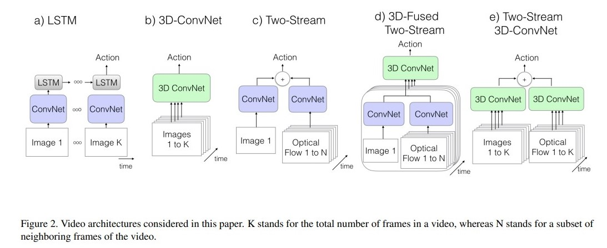
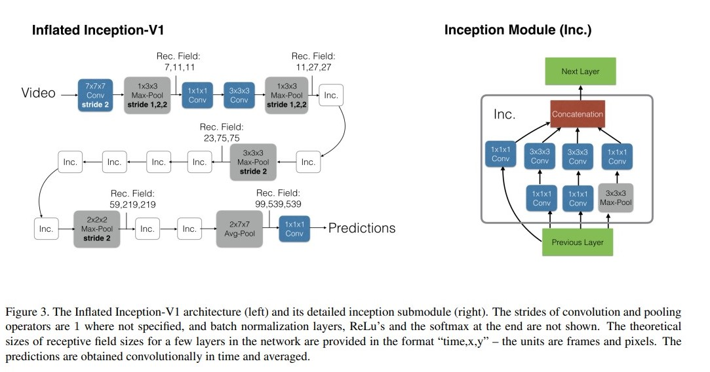

# i3d
[3d vision] [video]

inflated 3D network

## 概述
有一个 2d network 的结构，那么本篇论文的方法就可以将 2d network 直接 inflate 到 3d 上面，不需要做其他冗余的改动。推出了一个 kinetics dataset 数据集，视频数量是 300k，相比 Sports-1M 和 google 推出的 Youtube-8M，视屏数量确实少了一些。但是，Sports-1M 的类别都是运动类型，相对来说比较局限；google 的 Youtube-8M 则是太大了，甚至只能给出抽取好的特征来训练；kinetics 则是比较适中，而且类别广泛。

备注：Quo Vadis 意思是 你要去哪。电影讲的是古罗马昏君的意思。论文中的图片的意思想要表示的是，单一帧无法判断动作的上下文内容。提供了一个视频的数据集，可供视频分类的预训练。

transfer learning 里，fc 层抽出来的特征非常有用 -> 需要一个比 hmdb 和 ucf 还大的，更广泛的一个应用。
inflate 的意思就是，将一个已有的网络比如 resnet ，将他其中的所有 kernel 将 2d 卷积全部变成 3d 卷积，得到一个 video 上可以用的网络即可，这样的话，就不用做大量的 ablation study 去选取最好的结构。

## 模型结构

第一种流派就是利用 rnn 这种，最常见的是 lstm，作为 baseline。第二种则是，暴力的用 3D convnet 来获得 stack 很多帧的方法。第三种则是双流神经网络，two stream 有 spatial 和 temporal 两种信息融合的输入（spatial 的输入是单帧输入）。第四种是 3d-fused two stream 网络，他在 two stream 的基础上，增加了一个 3d convnet 来进一步提取最终的分类信息特征，而不是之前 two stream 简单的对两个网络的 softmax 输出进行加权和（这里是 early fusion，之前是 late fusion）。第五种的 two stream 3d convnet 和之前的网络输入主要是在 spatial 维度上的不一样。之前的都是用当前帧的图像作为输入，但是这里采用了 stack 的形式

inflate 的好处有：首先 2d 的网络的参数不需要太多预训练。使用的 backbone 则是 inception 和 resnet。但是，如何做 inflate 的呢？

1. 如何inflate？其实就是很直接的把所有 $3\times3$ 的 2D 卷积 kernel 直接变成 $3\times3\times3$ 的 3D 卷积 kernel；同理 2D pooling 也可以直接变成 3D pooling。Residual Block 依然还是 conv bn relu，都是直接用。同理 non local network 可以 inflate 成 3D 网络；timesformer 里也是直接 inflate；viedo transformer 同理；swin transformer 同理也是。

2. 如何得到一个好的训练效果：（从 2D 出发来初始化 3D 模型）从参数初始化本质来考虑：本质上是让输出一样。那么这里我们就可以复制 2D 的 kernel n次，然后 2D 的 kernel 做一个 rescaling （除以n），那么这样 2D 和 3D 的网络的输出都是一样的。这样就架起了一个从 2D 到 3D 的桥梁。

## 实验细节
左侧就是 inception 的网络。一开始就是 7 的 3D 卷积。但是有个小细节，时间维度上，不能做下采样，也就是说，$3\times3$ 的 kernel 就不要变成 $3 \times 3 \times 3$ 而是 $1\times3\times3$。时间维度上做下采样会损失很多时间上的信息。同理 2D pooling 会变成 $1 \times 2 \times 2$

inception module 的改动则是和 inflate 的操作完全一致，只是增加了一个 channel，然后直接 bootstrap 过去即可。

