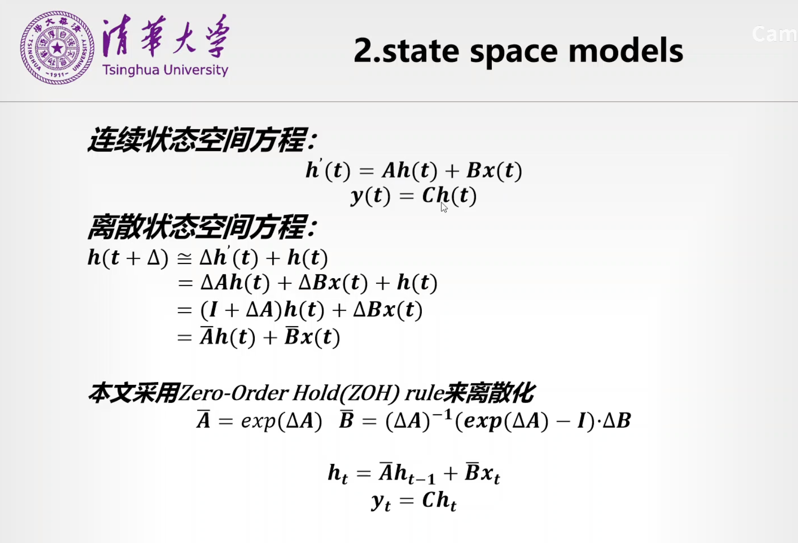
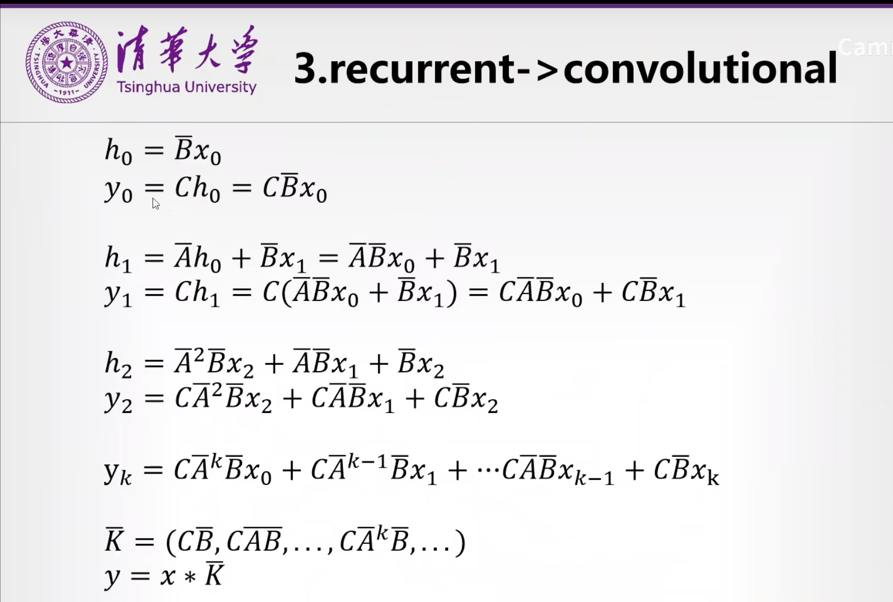
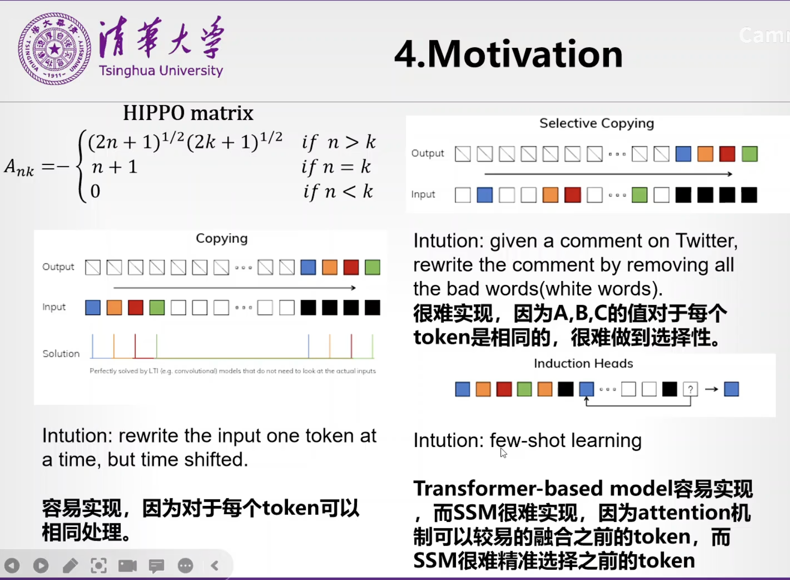
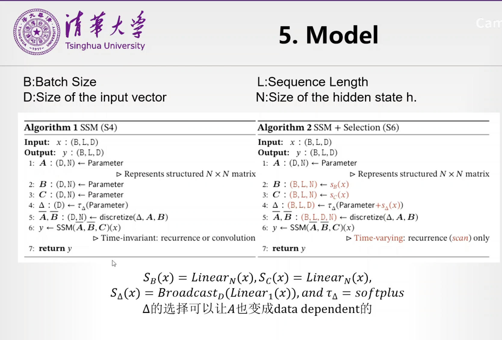
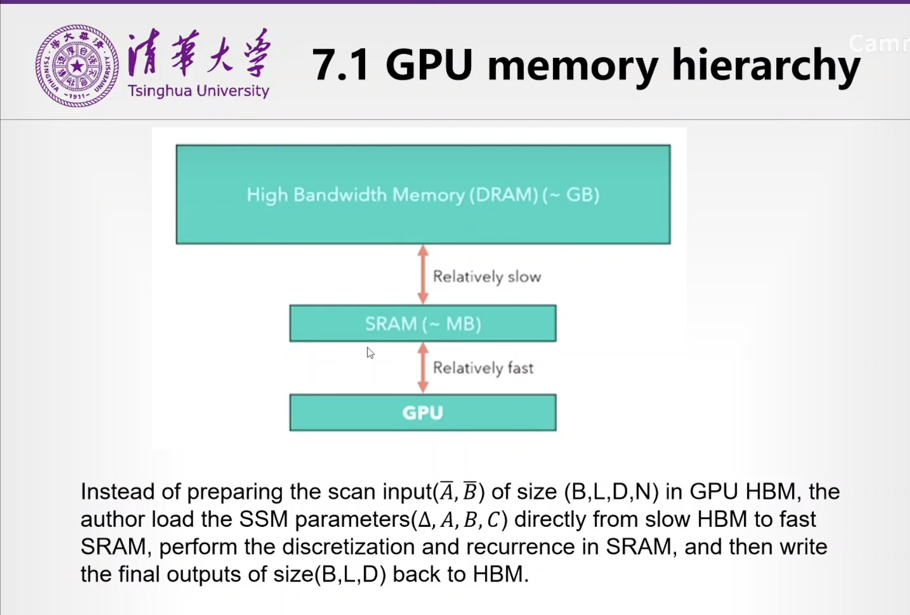
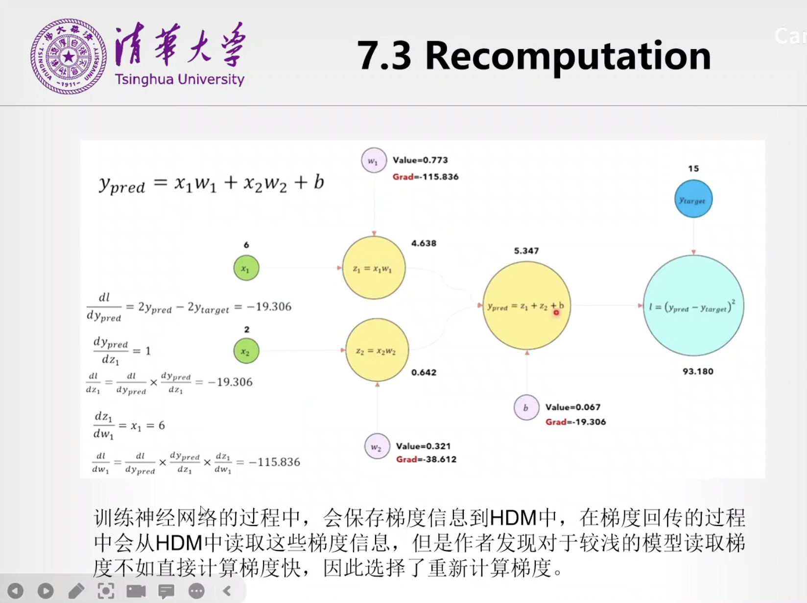
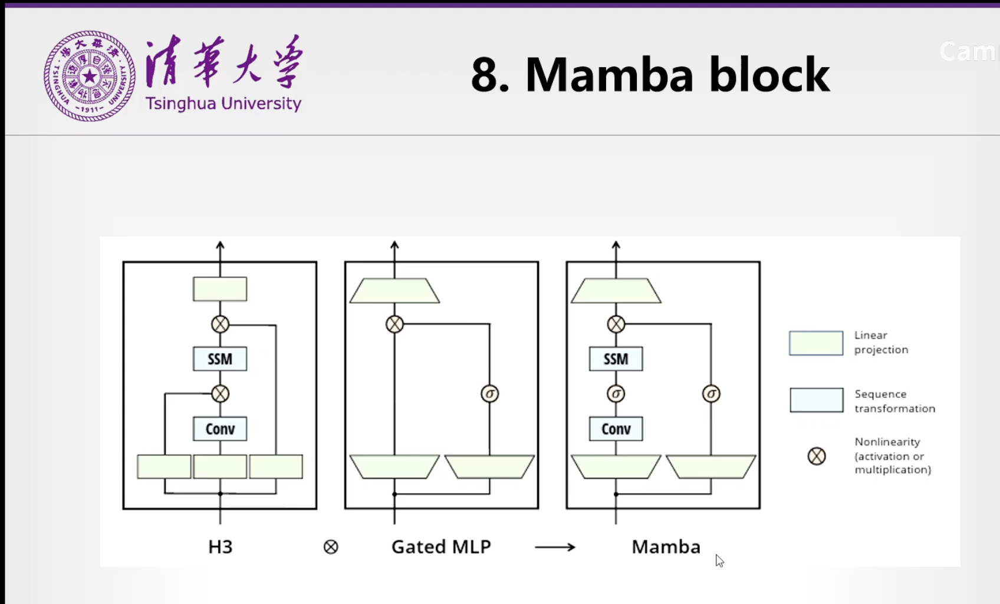

# Mamba

Mamba: Linear-Time Sequence Modeling with Selective State Spaces

https://arxiv.org/pdf/2312.00752.pdf

---

https://www.bilibili.com/video/BV1ux4y1C77T/?spm_id_from=333.337.search-card.all.click&vd_source=8635806d840eebcb9ee311685fcbaeaf

状态空间方程

用 ZOH 来近似离散状态空间方程，用 $\bar A$ 和 $\bar B$​ 来代替。然后用recurrent变成convolutional（并行化）

把 kernel 变成和 $\bar A$ 和 $\bar B$相关。

缺点：每个timestamp对 $A $ 和 $B$ 的参数设置是需要相同的

hippo matrix：发现把 $A$ 设置成hippo matrix 的形式比较好：

选择性：ssm不好做，只有状态；few shot也是，transformer好做，但是ssm做不了。那么作者就想引入 qkv 的思想，引入了attention机制

learnable的参数是 $S_B,S_C,S_\Delta,$ (B, L, D)分别是（batchsize，length，dimension）但是，如果把ABC进行替换，那么并行计算的前提就无法成立。那么就采用的 Parallel Scan 的形式。就是。。。用一些小trick，可以用 logN 的复杂度来实现 N 级别的

High bandwidth memory(DRAM) 高内存，SRAM 低内存，整个运算来说，矩阵运算，然后运算结果给到 sram。因为 dram 和 sram 很慢，那么作者就发现，可以先不计算出来 barABC，先把ABC读取过来在SRAM上操作。这个是pytorch的机制，会将计算结果保存回HBM，这就会导致循环计算特别慢。作者就只是把计算机过继续进行下次计算，多次计算之后的最终结果保存回 DRAM

pytorch在前向计算的时候，会保存梯度，而且在梯度回传的过程中会保存在 DRAM里面，对于较为浅的模型里面，不如直接计算梯度而不是保存梯度快，所以就使用了 recomputation的方式来计算梯度

单个block进行堆叠形成最终的mamba models

