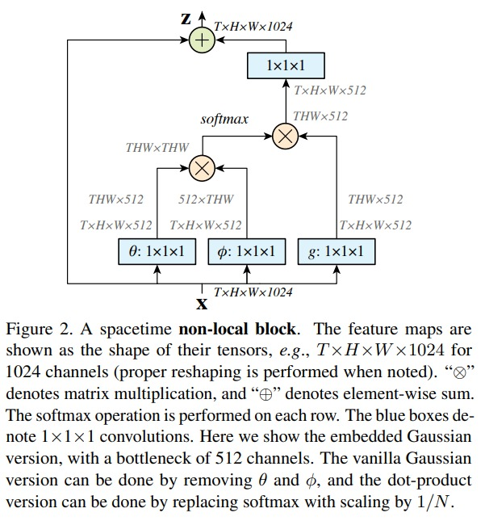
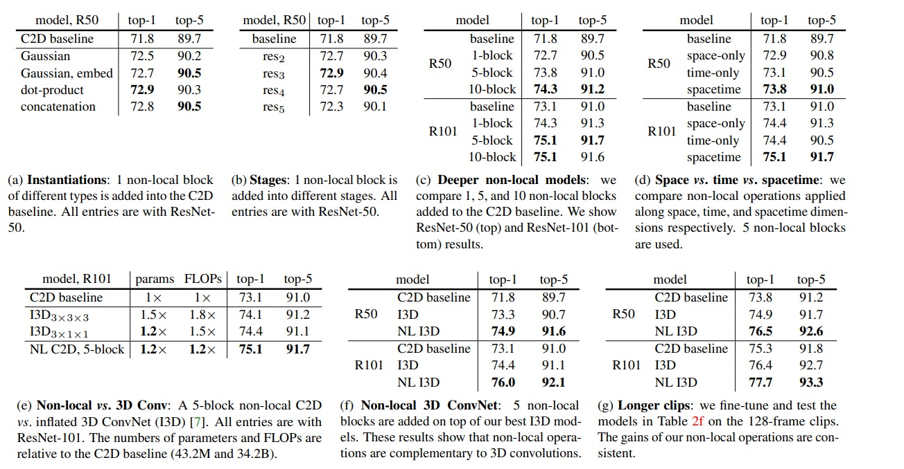
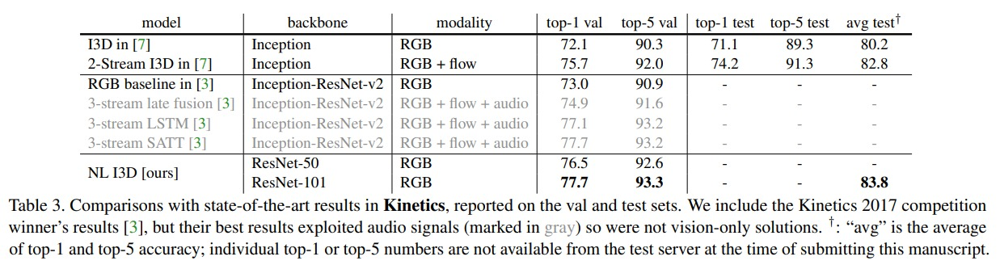

# Non Local

cvpr 18

在 transformer 之后，自注意力机制 attention 的出现，使得 cv 领域也带来的重大的改变。non local 便是其中的一个，他把 attention 的用法代入到了 cv video 的领域，得到了非常好的结果。

传统的卷积操作，也即 cnn 网络的基本构成部分，他最关注的就是局部邻域的一些信息，但是却没法得到全局的好的信息。所以作者就提出了 non local 这个算子，是一个可以泛化的模块，旨在建模长距离信息。

一个特征 x 进入 non local block
1. 然后得到 $\theta$，$\phi$，$g$ 分别对应 key，query，value 的 attention 操作
2. key 和 query 去做 attention 操作
3. attention 权重矩阵和 value 做加权和，然后和输入做残差链接
4. 和 attention 的模块非常相似

这里为了适配论文，所以这里就是把 2d 的 conv 也改成了 3d conv

Ablation Study：
1. 到底使用 gaussian，dot-product 还是 concatenate：
    1. dot product表现最好（和 transformer 结论一样）
2. 如何将 non local 插入到网络之中？或者说，差在哪里效果最好？
    1. 先做了一个简单尝试，加一层 non local block。在 resnet block（3，4，6，3） 后，发现加在第2，3，4后的效果不错
    2. 原因可能是第 5 个 block 之后，特征图大小太小了，没法学到 global 的信息
    3. attention 的计算复杂度又比较高，所以最后决定加在第 3，4 个 block 输出之后是比较合适的
    4. 到底加多少个 non local block 好呢？
    5. 试了 non local block 的个数从 1，5，10 开始相加。
    6. 越多的 non local block，对结果提高越多
3. Temporal 的 attention：
    1. space-only，time-only 的效果不如 spacetime 的 attention 机制。
4. 利用更长的视频输入，效果如何：
    1. 对于 128 帧输入，non local 还是能持续提高性能。

最后对比的是在kinetics 数据集上的结果

1. 注意，这里将 i3d 的 backbone 从 inception net 变成了 resnet 提升大概一个点
2. 加上 non local 之后 提升了 2，3 个点
3. 比双流 i3d 的结果还好。

本文贡献就是，将 attention 的操作引入了 cv 领域。将 space attention 增强到了 spacetime attention。

