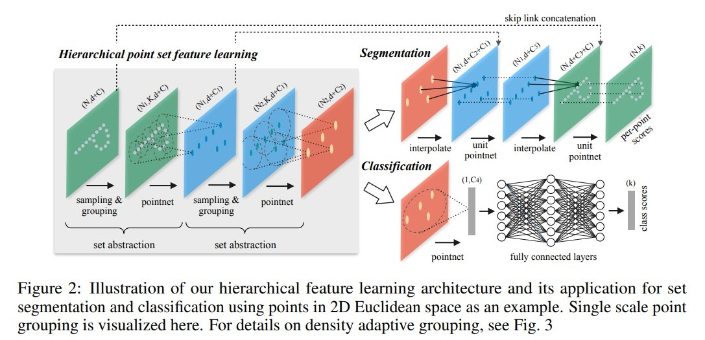
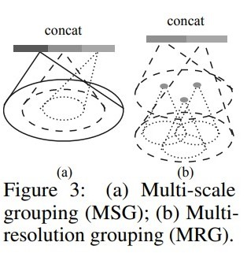

# PointNet++

之前我们提到过的 PointNet 有以下几个问题：
1. point-wise MLP，仅仅是对每个点表征，对局部结构信息整合能力太弱
2. global feature 直接由 max pooling 获得，无论是对分类还是分割任务，都会造成巨大的信息损失
3. 分割任务的全局特征 global feature 是直接复制与 local feature 进行 concat，生成 discriminative feature 能力有限。

PointNet++ 对上述几个问题的解决办法是：
1. sampling 和 grouping 整合局部邻域
2. 利用 hierarchical feature learning framework，通过多个 set abstraction 逐级降采样，获得不同规模、不同层次的 local-global feature
3. 对分割任务设计了 encoder-decoder 结构，先降采样再上采样，使用 skip connection 将对应层的 local-global feature 拼接

提取方法采用了分层抽取特征的思想，把每一次特征提取称为 set abstraction，包含采样层、分组层、特征提取层。采样层通过 fps（farthest point sampling）最远点采样算法，提取点云中的部分 key point。分组层以 key point 为中心，在某个范围内寻找最近 k 个 近邻点组成group。特征提取层将这 k 个点通过 PointNet 的核心网络进行特征抽取。这样每个层得到的中心点都是上一层中心点的子集、并且随着层数加深，中心点个数越来越少，但是1中心点包含的信息越来越多

最远点采样：用一句话概括就是不断迭代的选择距离已有采样点集合的最远点。
1. 输入点云有 N 个点，从点云中抽取一个点 $P_0$ 作为起始点，得到采样点集合 $S = \{P_0\}$
2. 计算所有点到 $P_0$ 的距离，构成 N 维数组 L，从中选取最大值对应的点作为 $P_1$，更新采样点集合 $S=\{P_0, P_1\}$
3. 计算所有点到 $P_1$ 的距离，对于每一个点 $P_i$ 如果其距离 $P_1$ 的距离小于 $L_i$，则更新 $L_i=d(P_i, P_1)$，因此整个数组 $L$ 一直维持着未被采样的点到采样点集合的最大距离
4. 选取 $L$ 种最大值对应的点，作为 $P_2$，更新采样点集合 $S=\{P_0, P_1, P_2\}$
5. 重复 2-4 步骤，直至采样点集合大小为 N 

注意有这么几个问题：第一个是初始点选择，第二个是采样用的距离度量。

解决点云密度不均匀的问题：由于雷达传感器的成像特点。离传感器越近的区域点云更密集，越远的地方约稀疏，所以如果在group的时候通过在固定范围选取的固定个数的近邻点是不合适的。所以 PointNet++ 提出了两种自适应点云稠密系数的方案。分别是：多尺度组合 MSG（multi-scale grouping，MSG）方式、多分辨率组合（multi-resolution grouping，MRG）方式。

多尺寸分组（MSG），对于同一个中心点，使用3个不同尺度分组，不同尺寸的区域送到不同参数的 PointNet 中进行特征提取周concat。相当于 MSG 实际上是并联了多个 hierarchical structure，本质就是感受也不一样（上图中的 a）。MSG 有个特点就是会降低运算速度。那么，为了提高运算速度，提出了 MRG（multi resolution grouping） 的方法。

在 PointNet 的结构中会有 encoder-decoder 结构，那么 MRG 就是将不同维度下的 feature 都提取出来进行特征抽取，然后再和 decoder 一同 concat。相当于 U-Net 的 skip-connection 的结构。

为了提高模型的 robustness，作者还会采用 random input dropout（也就是点云输入的 dropout）（实验证明在点云稀疏的时候，random input dropout 可以保持很好的 robustness）

源码来看，主要有这么几个函数：
1. square_distance 函数：
    1. 目的是为了返回 n 个点和 m 个点距离的矩阵
    1. 输入是 $(bs, n, c)$ 和 $(bs, m, c)$
    2. 返回 $(m, n)$ 的矩阵
2. farthest_point_sample 函数
    1. 目的是为了用 fps 算法得到若干采样点
    2. 输入是点云 $(bs, n, c)$ 和 采样点个数 $npoints$
    3. 返回点云的采样点 index 下标 $(bs, npoints)$
3. index_points 函数：
    1. 目的是根据给定的 index 下标，返回对应的坐标
    2. 输入是点云 $(bs, n, c)$ 和 下标 $(bs, D_1,...,D_N, c)$
    3. 返回这些 index 对应的点的坐标 $(bs, D_1,...,D_N, c)$
4. query_ball_point 函数：
    1. 目的是用于寻找球型领域中的点
    2. 输入是点云 $(bs, n, c)$ 和 球半径 $r$ 和 最大采样个数 $nsample$ 和 query点坐标 $(bs, s, c)$
    3. 返回分组好的点的下标 $(bs, s, nsample)$
5. sample_and_group 函数：
    1. 目的是将点云分成若干个 group 做为 pointnet 的输入
    2. 输入是 fps 采样个数 $npoints$，球半径 $r$，每个球内最多采样点 $nsample$，点云 $(bs, n, c)$，feature 维度的输入 $(bs, n, d)$
    3. 返回 采样点的坐标 $(bs, npoints, c)$ 和 采样点的 feature $(bs, npoints, nsamples, c+d)$
6. setabstraction 层：
    1. 函数目的是将点云的特征进行提取，然后得到剧本的"全局特征"
    2. 初始化是 npoint， radius，nsample，in_channel，mlp的channel list
    3. 输入是点云 $(bs, n, c)$ 和 数据特征 $(bs, n, d)$
    4. 输出是 max pooling 之后每个邻域的feature，最终维度是 $(bs, s, c)$ 和 $(bs, s, d')$
7. pointnetfeaturepropagation 函数：
    1. 根据不同的任务类型得到最后的输出
    2. 输入点云 $(bs, n, c)$ ， 采样点 $(bs, s, c)$，输入数据特征 $(bs, n, d)$，采样点特征 $(bs, s, d)$
    3. 输出 点云特征 $(bs, n, d')$
8. 网络结构：
    1. 输入 点云原始数据
    3. 过 pointnetsetabstraction 得到不同的 采样点，过多次，得到 hierarchical 的特征，过几层 cnn 得到最终的feature
    2. 输出最后的 分类 softmax probability

