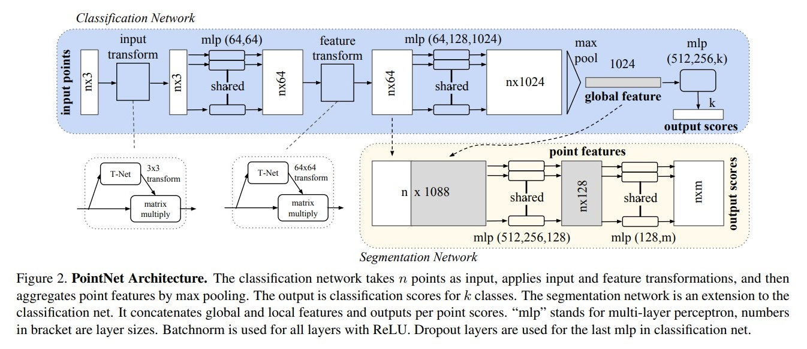

# PointNet

在描述 pointnet 之前，我们需要对点云有所概念。点云是从现实中 3D 扫描技术而来的。常用的 3D 扫描技术是 LiDAR，仪器会从发射端发射一些激光，打到被扫描的物体上，反射后被仪器接受。通过计算发射和接受的时间差，就可以知道反射点距离摄像头的位置。通过发射许多条激光，可以获得若干个点，形成点云。

点云有以下的特征：
1. 稀疏性：点云数据仅存在于物体表面
2. 数据缺失：由于遮挡导致部分表面违背扫描到
3. 数据噪声：仪器本身的精度或者环境因素导致
4. 非均匀性：由仪器的采样策略、相对位置、扫描范围等因素引起的。

PointNet，做为本章的方法，直接将原始的点云作为输入，没有任何其他信息，输出整个点云的类标签（classification）或者对每个点的分割标签（part/semantic segmentation）PointNet 针对点云的特点，提出了一种网络结构，可以直接从点云种学习特征。点云在数据上表现得特性为：
1. 排列不变性：重排一边所有点的输入顺序，所表示的还是同一个点云数据，网络的输出应该相同
2. 点集之间交互性：点与点之间有位置的相关性
3. 变换不变性：对于空间上的仿射、旋转变换，应用在点云上，不会改变点云的类别属性等性质

PointNet 是这么处理这三个特点的：
1. 排列不变性：运用对称函数（Symmetry Function），特点是输入集合的顺序不敏感，比如 maxpooling，avgpooling等。
2. 交互性：得到了部分全局信息之后，将特征向量与全局的特征向量 concat 起来，就可以让每个点感知全局的语义信息了。
3. 变换不变性：只需要对输入做一个标准化操作即可。PointNet 使用网络训练出了 D 维空间的变换矩阵

具体方法：
1. 排列不变性：用 maxpooling 和 mlp 来做组合。$h(x)$ 函数是 mlp，g 是 maxpooling，那么具体做法就为：
$$
f(\{x_1,...,x_n\})\approx g(h(x_1),...,h(x_n))
$$
tensor 经过网络的 pipeline 为：
$(n\times 64)$ （输入张量维度）-> 经过 64, 128, 1024 的 mlp -> $(n\times 1024)$ -> 做 maxpool 得到最后的 global feature -> $(n\times 1024)$

2. 点集之间的交互性：在 classification 的过程中没有用到局部特征，只用到了全局特征；在 segmentation 的过程中将每个点的 64 个特征和 1024 个全局特征 concat 起来形成了长度为 1088 的特征。这里注意局部特征只用到了每个点，而没有用到点与周围点的关系。（这里会在 pointnet++ 种被改进）

tensor 经过网络之后，会得到一个 $(n\times 1024)$ 的全局特征，这个全局特征和原始输入的 $(n\times 64)$ 在 feature 通道上 concat 得到 $(n\times 1088)$

3. 变换不变性：这里用了一个叫做 T-Net 的小型网络来模拟一个仿射变换矩阵。T-Net 和普通网络类似，也是有特征提取层、最大池化层、全连接层组成。T-Net 的本意是，对任意输入 x，想要学到一个能比较好的映射的放射矩阵，而不是一个固定的仿射变换。能够学到一个为了保证 T-Net 学到的是一个仿射变换，那么我们通过 softmax 损失函数种增加了下面的正则化项，使得该矩阵尽量为正交矩阵：
$$
L_{reg}=||I-AA^T||^2_F->0
$$
T-Net 的 pipeline是（以 $3\times3$ 为例）：

$(n\times3)$（输入张量维度）-> 经过 T-Net 的 3 次 $1\times 1$ 的卷积（分别是 3，64，128，1024 的 channel 数）-> 经过 3 次 fc 层 （分别是 1024，512，256，k*k，k=3）-> 最后得到一个空间维度是 k 的仿射变换矩阵 -> $)$
然后将这个得到的仿射变换矩阵乘以我们一开始的输入，就得到了一个变换之后的 tensor 。
$$
(n, k) - conv - (n, 64) - conv - (n, 128) - conv - (n, 1024) \\
- fc - (n, 512) - fc - (n, 256) - fc - (n, k*k) \\
(n, k) \times (n, k, k) - (n, k) 
$$

T-Net 的 loss 在 softmax 训练损失基础上，添加了一个正则项（上述提到的 $L_{reg}$）

实验部分，基本上就是试了一些 MLP（unsorted）、MLP（sorted）、LSTM、Attention Sum、Average Pooling、和本文的 Max Pooling 的消融实验；加上 T-Net 的正则项的消融实验；去除部分点云对最后效果的对比；

