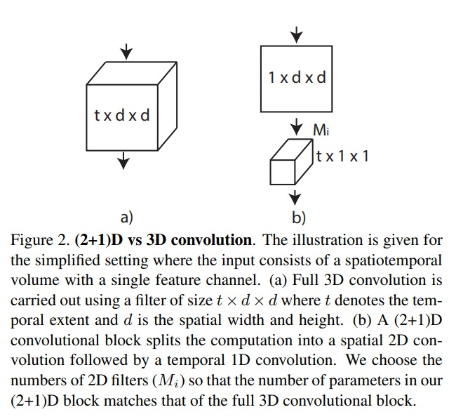

# R(2+1)D

A Closer Look at Spatiotemporal Convolutions for Action REcognition

CVPR 18

本文是一篇非常实验性的论文，目的是到底什么时候用 2D 什么时候用 3D，以及怎么融合。毕竟 2D 的计算复杂度比 3D 少很多。最后的结论是，将 3D 的卷积拆分成空间上的 2D 和时间上的 1D 效果最好。

1. 纯 2d 网络，上图中 a 的结构
2. MCs，头重脚轻的方法，先 3D，然后再换成 2D 的方法
3. rMCs，头轻脚重，先 2D，然后再换成 3D 的方法
4. 纯 3D 网络
5. R(2+1)D，先做 spatial 2D 的卷积再做时间上的 1D 卷积，也就是本文的做法，也是效果最好的

1. 从参数两来看，只用 2D 的网络参数会非常少
2. 只用 2D 或者 只用 3D 的效果并不突出
3. 3D 2D 混用的网络效果最好
4. 拆分结构的形式，效果最好。同参数量的情况下，

拆分 3D 卷积成为两个 2D 和 1D 的方法：
1. 3D 的卷积核 $(t,d,d)$
2. 拆分为：
    1. 先是 $(1,d,d)$ 的卷积
    2. 做一个空间的特征投射 M，把维度变换一下（目的是为了让参数和 3D 情况下维持一致
    3. 做一个 $(t,1,1)$ 的 1D 卷积
3. 这种拆分的形式好的原因：
    1. 增强了网络的非线性，relu 层数更多
    2. 直接学 3D 卷积，并不是那么好学，拆分成 2D 和 1D 比较好学

最后看一下结果：
1. k400 上只有 i3d，只能和 i3d 比较
2. r2+1d 在 rgb 和 flow 上的结果，都比 i3d 要高。但是做 late fusion 之后，i3d 的提升非常明显，r2+1d的提升却不明显
3. 在 ucf-101 和 hmdb51 上，rgb 的结果确实要好。但是 flow 却不太行
4. 但是提了一嘴，r2+1d 的预训练模型，是只在 k400 上做的。但是其实不成立，i3d 也用过不在 imagenet 上 pretrain，只在 k400 上 pretrain 的结果，而且丝毫不差

