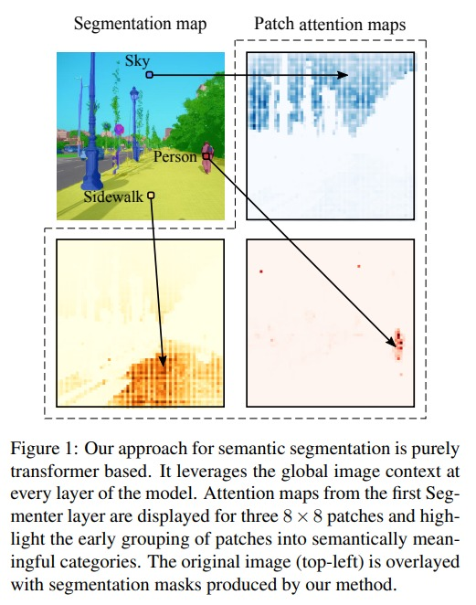
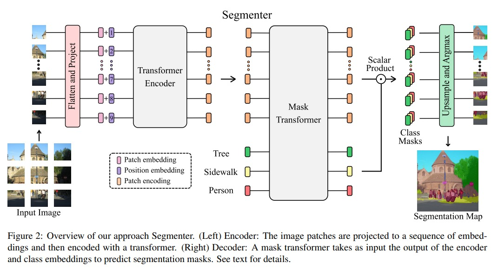

# Segmenter

Segmenter: Transformer for Semantic Segmentation：
https://arxiv.org/pdf/2105.05633.pdf

## Encoder

这部分我们先过一边 encoder 的流程。

1. 和 vit 流程非常相似，显示对图像进行分 patch。原始图片 $x \in \mathcal{R}^{H\times W\times C}$ 会被分成 $x = [x_1,...,x_N]\in \mathcal{R}^{N\times P^2 \times C}$，这里 $P$ 是 patch size，$N = HW/P^2$
2. 将每个 patch 都拉成一个 1D vector 然后送进 fc layer 得到一个 $x_0 = [Ex_1, ..., Ex_N]\in \mathcal{R}^{N\times D}$
3. 加入 learnable 的 position encoding $pos = [pos_1,...,pos_N]\in\mathcal{R}^{N\times D}$，最后得到送入 encoder 的输入是 $z_0 = pos + x_0$
4. encoder layer 每层的具体结构都和原始的 transformer 差不多
$$
a_{i-1} = MSA(LayerNorm(z_{i-1})) + z_{i-1} \\
z_i = FeedForward(LayerNorm(a_{i-1})) + a_{i-1}
$$

## Decoder
1. $z_0\in \mathcal{R}^{N\times D}$ 经过 encoder 之后得到 $z_L=[z_{L,1},...,z_{L,N}]\in\mathcal{R}^{N\times D}$
2. 我们最终还是要得到一个和原图大小一样的 output map $s \in \mathcal{R}^{H\times W\times K}$
3. 和 DETR 的 object query 一样，这里设计了 K 类的 learnable class embeddings $cls = [cls_1,...,cls_K] \in \mathcal{R}^{K\times D}$
4. class embedding $c\in\mathcal{R}^{K\times D}$ 和 patch embedding $z_M'\in\mathcal{R}^{N\times D}$ 做点积：
$$
Masks(z_M',c) = z_M'c^T \in \mathcal{R}^{N\times K}
$$
5. 每个 masks sequence 会被 reshape 到 2D 也就是有 $s_{mask} \in \mathcal{R}^{H/P\times W/P \times K}$，之后用 bilinear 算法 upsample 到与原图一样的 map $s\in\mathcal{R}^{H\times W\times K}$
6. 

