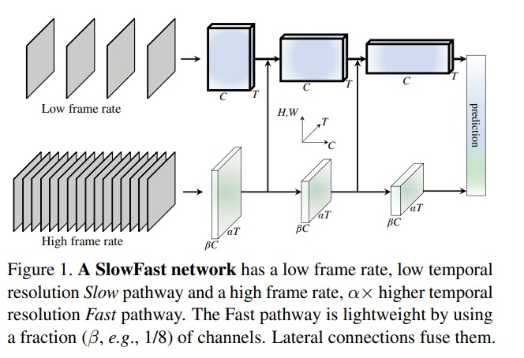
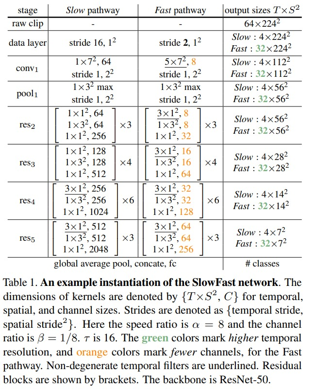
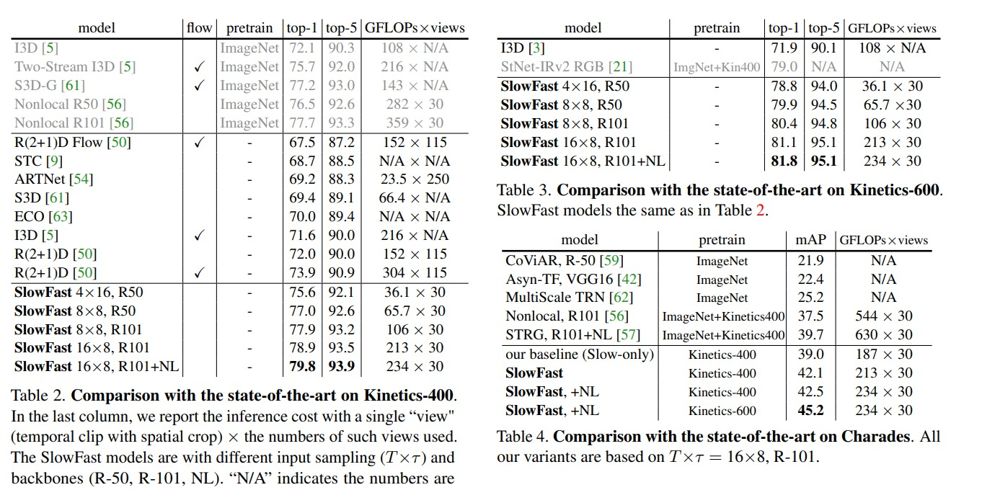

# SlowFast

本文还是单纯的 3D 网络。p 细胞数量多，处理静态信息，占比多。m 细胞占比少，处理动态信息，占比少。和双流网络很像。于是 3d cnn 也可以这么设计。SlowFast 有两条网络，一条是 slow，一条是 fast。
1. 假设有一个视频，视频总共 64 帧，第一种我们用每隔 16 帧采样一次，那么就是 slow 信息，slow 分支的权重比较高，但是输入少，所以总体的计算复杂度不高
2. Fast 分支则是：每隔 4 帧 进行一次采样。Fast 分支输入多，但是网络参数量少，所以也不会有很高的计算复杂度

整体上来看 slowfast 也是一个双流的网络结构，两个分支之间，运用了 lateral connection，从而信息也能互相交互，最后得到一个精度和速度的结合。

前向过程：
1. slow 分支就是标准的 resnet 网络，i3d 的设计
2. fast 分支，在黄色的通道数上有对比，fast 分支通道数远远小于 slow 分支。
3. 输入的维度在表格右边有显示，可以说是非常详细了。
4. 时间维度上，spatial 的 channel 数，本来就不多，尽量不下采样，fast 分支也是。

结果看：
1. slowfast 不需要预训练模型，但是训练时常比较长。
2. 精度上非常好
3. gflops 高，效率高

