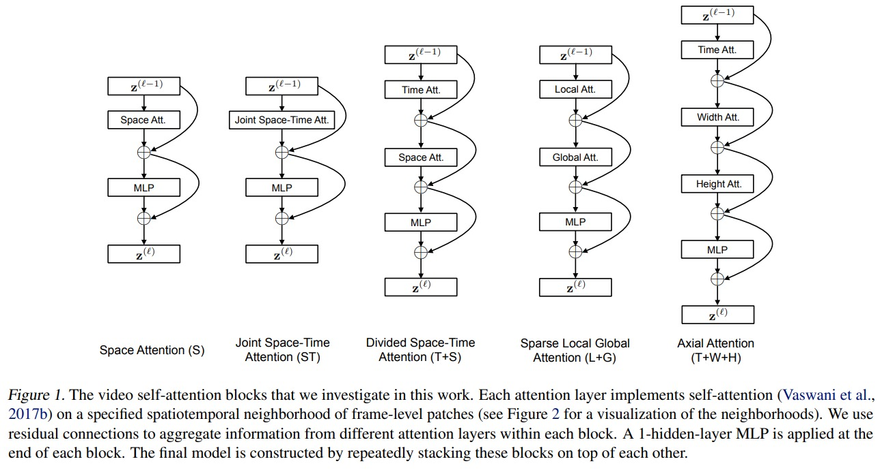
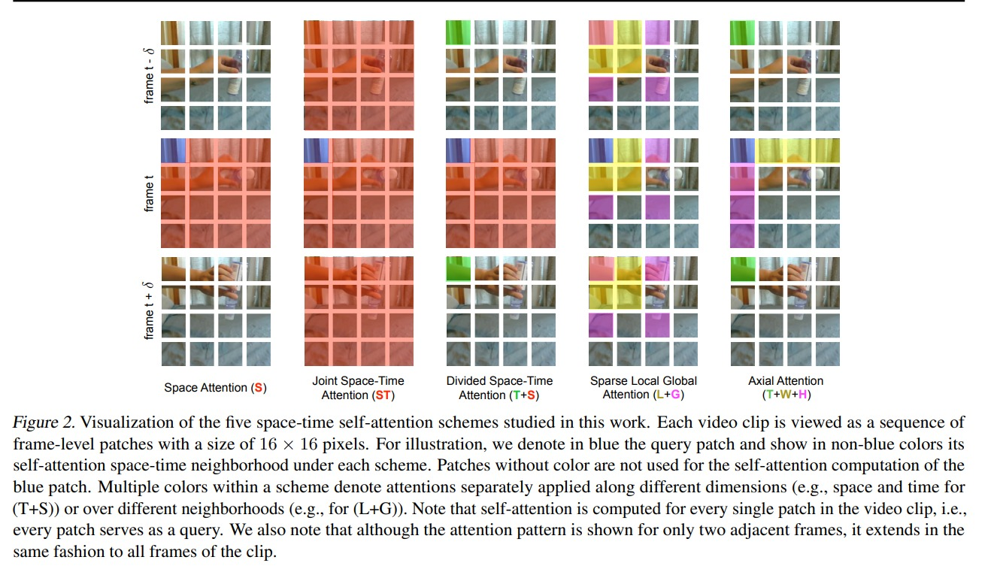

# Timesformer

Video Transformer 里的一篇 Timesformer。也是一篇，比较偏实验的论文。

1. 第一种就是 space attention，也就是在图像中常用的形式
2. 第二种 joint space time attention，就是暴力的在三个维度上，都做 attention，缺点就是 gpu 肯定塞不下
3. 3D 塞不下，那就可以像 r2+1d 一样，进行拆分：先做 spatial 的 attention 再做空间上的 temporal attention
4. 全局序列长度太长，那么先在局部小窗口做 sparse 的 attention，然后再做 global 的
5. 最后一种就是，只沿着特定的轴做 attention，先 time，再 width，再 height，将 3D 问题，拆分成了 3 个 1D 的问题

上图就是可视化的，自注意力机制的方式：
1. 蓝色的 patch 是基准，橙红色是可以看到的不同 patch
2. 同样的，蓝色 patch 是基准，所有橙红色的 patch 都可以被 attention到
3. 蓝色的 patch，在同一帧上所有的橙红色都可以做 attention；以及所有时间轴上的对应的绿色的 patch 做 attention
4. 蓝色 patch 为基准，不同帧上的 小窗口黄色上做 attention，然后 sparse 的淡紫色 patch
5. 蓝色 patch 对，时间轴绿色 patch，width 轴黄色 patch，heighth 轴紫色 patch 做三次 attention

Ablation study 结果：
1. divid space time（也就是第三种）效果最好
2. joint space 方法的结果在 K400 的数据集上不错，但是因为 K400 的静态信息很多，所以可以取得不错的效果
3. 训练时间 timesformer 速度很快，比 slowfast 快很多。
4. 推理上 timesformer 速度也很快
5. 效率角度而言，timesformer 效率非常好
6. timesformer large 还是把 k400 刷到上 80 了

timesformer 可以做长视频的视频理解了，稳健性好。接下来的工作，多模态、稳定性、大型视频的很多方向，都是可以做的。
