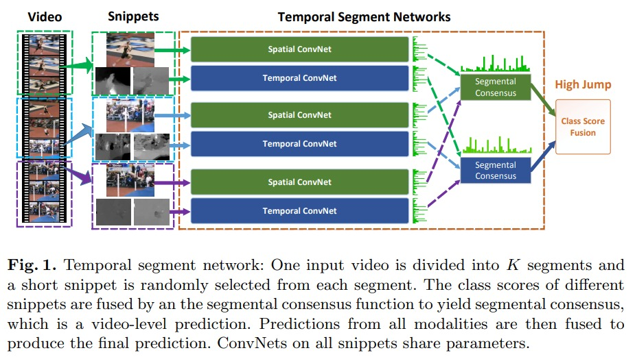
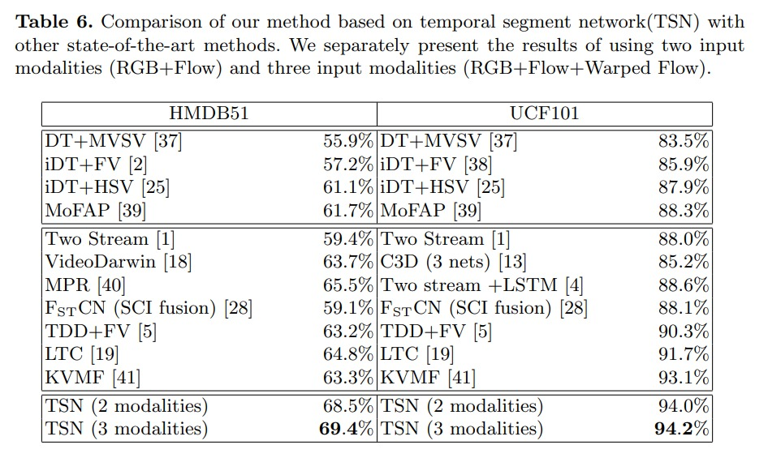

# TSN

Temporal Segment Networks: Towards Good Practices for Deep Action REcognition

ECCV 2016 中稿论文。用了一种非常简单的方式能够处理非常长的视频，而且效果特别好。而且确定了很多好用的，能够 work 的1技巧。包括数据增强、模型初始化、如何使用光流、如何防止过拟合。很多技巧沿用至今。

如果有一个原始的 two stream 网络，那么能覆盖的视频长度也就是几十帧，时间跨度实在是太短了。tsn 的想法就非常简单，把视频分成若干段，每一段随机抽取一帧做为 spatial 的输入，然后连续几帧做为光流 temporal 的输入。后面的流程，按照双流网络过 pipeline。所有 spatial convnet 和 temporal convnet 都是共享参数的。然后得到了若干个片段的若干特征，那么最后会做一个 segmental consensus，也就是 fusion，空间上和时间上的 consensus 做一个 late fusion，那么我们得到最后的 logits。

想法非常简单，但是对于长、短视频都适用，短视频可以直接做加权的 fusion；对于长视频来说，每个片段语义不一样的情况下，可以做 lstm 的 fusion 结果。tsn 之后的另外一篇工作，untrimmed net 就是专门针对长视频的视频分类任务的工作。tsn 是 supervised 的方式，untrimmed net 是弱监督的方式。

temporal segment 同样也适用于无监督的训练方式。之前的工作往往将视频里任意的两帧当作正样本，其他所有帧做为负样本。 但这样的话，视频较长的情况下，任意抽取的两帧，不一定是正样本；这时候就可以将视频分段，在段内选取正负样本。

训练技巧：
1. Cross Modality Pre-training：modality 指的是图像和光流的多模态。主要指的是图像有 imagenet 可以做预训练，但是 光流 却没有，那么光流的效果可能会被打折扣。那么作者提出用 imagenet 的 pretrain model 给光流也是可以的。但是问题在于 imagenet 是 rgb 通道，optical flow 是 20 个 channel。那么解决办法是将第一个 channel 做了改变。第一个 rgb 的 channel 上做了平均，将 3 通道变成了 1 通道，然后在当前通道上 repeat 20 遍即可。（i3d 的 inflate 很像）

2. Regularization Techniques：提到了 bn 的使用问题。bn 可以让训练加速，但是同样带来了很严重的过拟合的问题。作者提出了 partial bn 的做法。因为如果 bn 微调就会导致很极端的过拟合的问题，那么就把 bn freeze 比较好。但是全部都 freeze，会导致结果不好。所以作者的 partial bn 意思是，将第一层的 bn 打开，其他的全部都 freeze 住。这样来适应新的数据集。

3. Data Augmentation：
    1. corner cropping 和 scale jittering。corner cropping 的初衷是如果随机做 crop，那么很容易就 crop 在图像的相对中间的位置，所以作者就强制性的在边角，进行 crop。
    2. scale jittering 意思是改变长宽比。做法是先把图片 resize 到 356 * 340，那么在预定好的一些比例中选取不同的长宽比，这样去做数据增强，减少过拟合。

结果：

最上面一层是手工特征的结果。

1. Two stream 是双流网络的结果
2. VideoDarwin 是用 ranking function 做的，但是并没有太多后续的工作
3. C3D 是 3d-cnn 早期的工作，即使用了 3 个 cnn，也才 85.2%，不如 two-stream 和 手工
4. Two-stream + LSTM 就是 BeyondTwoSnippets 的结果
5. TDD 的工作就是，将光流从简单的堆叠，改成在轨迹上的堆叠（也是 two stream 中提出的两种方式）
6. 最后 tsn 的两个 modalities 是 rgb 和光流，在 hmdb51 上已经有 68.5% 的准确率了，在 ucf-101 上也有 94.0% 的准确率了

在 cvpr 的 tle 也做到了非常高的结果。

