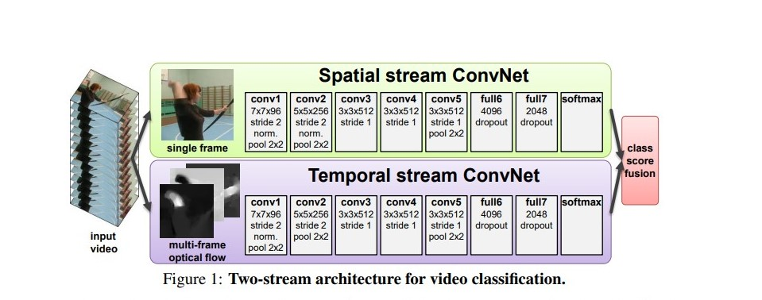
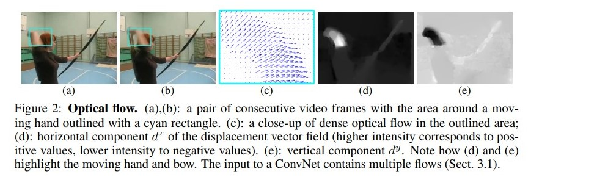
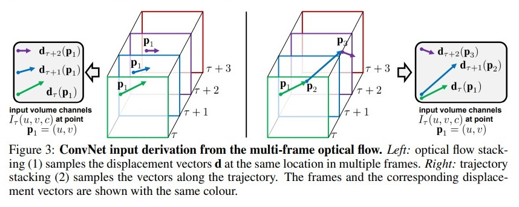

# Two Stream
[video] [optical flow] [action recognition]

## 设计初衷

在 two stream 之前，大部分视频分类的工作，基本上都是手动特征、传统算法来识别。用深度神经网络来分类视频动作的方法基本上是抽取关键帧，用暴力 stack 的方式直接送给 deep convnet 来学习视频的特征。但是这样的做法一直不好。two stream 则是，除了正常的视频原本的 rgb 通道送给 convnet，还抽取了 optical flow 来送给 convnet。前者是每一帧的信息，称为 spatial 信息。后者是提取了帧与帧之间的时序信息，称为 temporal 信息。

convnet 效果好的本质原因其实还是局部信息的提取，但是卷积操作这种，将 channel 数简单的叠加方式，并不好。two
stream 发现，之前的手工特征都是光流信息。光流信息提取了时间维度上的信息，比原本的 convnet 的方式精细很多。

## 数据集
UCF-101：13k 视频，平均每个视频 180帧，总共 101 种动作分类

HMDB-51：6.8k 视频，总共 51 种动作分类

Sports-1M：1.1M YouTube 视频，都是 sports 类型的

## 网络结构

上半部分是 spatial 部分的 convnet，标准的 vgg 结构，是一帧一帧的输入，是图像分类任务，和视频并没有太大关系；本身是为了识别出来一些关键的图片信息，比如球拍、小提琴、钢琴这种。而且可以用 imagenet 去预训练，在大数据集上做预训练对于最后的分类准确度非常有帮助。

下半部分是 temporal 的 convnet。光流的处理，分别就是水平方向上两帧的矢量差，所以光流的输入大小就为 $W \times H \times 2$，通道数是水平和竖直的光流。使用光流有两种方法：第一种是直接暴力 stack；第二帧是对齐光流的点，也就是按照光流的方向来 crop 选取。前者是 figure3 的左边的暴力 stack；后者是 figure3 的右边的按照光流的方向来表示。可惜的是，左边的暴力叠加是比右边的效果要好。

最后还有一种方式 bi-direction 来做光流的叠加。这种方式和 cascade 以及 pyramid 都是非常好的涨点方法。说白了就是叠加的方式除了 1 - t 的光流， 也叠加了 t - 1 的光流。但是为了对比公平，帧数（channel）都是保证和 single-direction 的帧数保持一致，都是 2L

input 的维度是 $(3 + L_{horizontal} + L_{vertical}) \times W \times H $，最后softmax输出是 $2 \times classes$，最后取一个 softmax 的概率输出取一个平均，也称为 late fusion

## 测试细节
不论视频多长，等间距的取 25 帧作为输入。每一帧都会做一个 10 crop（4个边角 + 中间，翻转之后再取 4个边角 + 中间）总共250帧作为空间流的输入。对于时间流来说，也是一样的选取这样的 250 帧，然后抽取光流。（这就是常说的 250 view，也有的有 150 view，100 view，这个结果在对比的时候，需要横向对比）在 3D video 去做测试的时候，往往就变成了 30 view；vision transformer 的时候又变了，有些时候就是 3 view，4 view 等。

计算光流的方法是 OpenCV 的 toolbox，每帧大概 0.06 秒。但是对于 UCF-101 数据集来说，这个数据量、抽取光流时间也是不可取的，更不用说 Sports-1M 这种更大的数据集来说了。后面来说，dense 型的光流，用 jpeg 来存成图像，并且可以压缩（jpeg 的压缩算法来存储，就可以缩小存储量大概 100 倍）。

## 实验细节
预训练方式 + dropout rate + 微调的方式

dropout rate 0.5 vs 0.9；微调整个网络 vs 微调最后 fc 层
dropout 0.9 不担心过拟合 + 微调整个网络 -> 不用担心过拟合问题效果好
dropout 0.5 可能会过拟合 + 微调最后一层 fc -> 过拟合行为抵消，效果好
