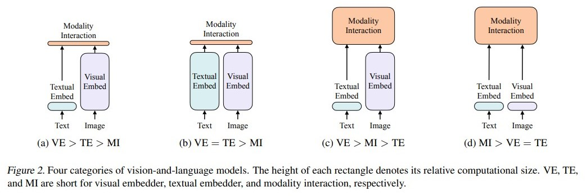

# Vilt
Vilt: Vision-and-Language Transformer Without Convolution or Region Supervision
https://arxiv.org/pdf/2102.03334.pdf

cv 领域里，如果引入目标检测模块的方法，在整个 infer 阶段用了目标检测的方法，整个模型运行时间 900 ms，但是视觉部分就占了 885 ms，文本只占了 15 ms，加速就非常重要

## 摘要
试卷文本预训练 vision and language pre-training 在过去几年发展的不错，但是之前的方法在下游任务上表现的好，一般会在 vision tasks 里面用非常重的 model。但是有几个问题：
1. vision moodel 抽取 feature 时间太长
2. 如果只用预训练模型抽取 feature，则表达能力会非常受限（受限于 detection 数据集的规模不够）
3. 收到 vision transformer 的启发，图像的预处理，就用一个简单的 fc 即可
4. 所以 vilt 比之前的 multimodel 更快，在 performance 上也能够持平

## 引言部分
多模态很火，本质上是采用了预训练 + 微调的模式上（借鉴 nlp 和 cv），预训练好甚至能 zero-shot。2019 年出来过三篇，vl bert，visual bert，vil bert 等。预训练完成之后，就是微调即可。下游任务一般牵扯到两个模态，分别是 vision 和 language。整个 pipeline 框架就是上述，但是牵扯到很多细节。对于文本来说，整个框架和 bert 已经非常相似了，没有太多改进了。但是 vision 这块，需要有一个与 language token 语义相符的进行匹配。
1. 对于 vit 来说，是将图像分成了 patch 大小，然后将 patch 的 feature 给到下游的和 language 融合阶段即可
2. 但是 vit 是 2021 年的工作，vlp 一般是依赖一个目标检测器，因为 vision 需要一个 离散性好，语义强的 token
3. bounding box 是离散的，每个 bounding box 内都有一个物体，含有强语义，非常符合
4. 大部分 object detector 是在 Visual Genome Dataset 上预训练的，含有 1600 物体类别和 400 类属性类别
5. Pixel Bert 就是在 imagenet 上训练的残差网络，当作是一个离散的序列，和 VitHybrid 一样
6. vilt 的想法就是，如何抽取一个轻量级的 图像的特征

从上图中可以看到：在上半部分，基本上是 image - cnn backbone - detector backbone 来抽取特征
1. vision 和 language 的特征融合方法：
    1. single stream：直接将 seqlen （token）个数相等的两个 tensor 进行融合，然后直接 concate
    2. two stream：vision 和 language 进入两个不同的 model 然后来抽取特征
2. Pixel Bert：
    1. 对于 detection 任务，需要的 infer 的时间实在是太长了
    2. 所以把 image 的网格特征（就和 vit 里面一样，分 patch 来做）
    3. 然后经过一个 cnn backbone 然后来得到固定 token 的 feature
    4. 计算复杂度可以降低非常多
3. Vilt
    1. linear embedding 和 cnn backbone 抽取特征得到的结果其实差不多
    2. 所以 Vilt 直接将 cnn backbone 切换成 linear 来抽取特征
    3. vision 和 language 都用了 fc，一个是 patch embedding，一个是 word embedding
4. 对比了 NLVR2 的对比
    1. 还是用目标检测特征是比较好的
    2. 否则掉点太多
5. Vilt 总结：
    1. Vilt 是迄今为止，最简单的 multimodel 的 model
    2. Vilt 在减少计算复杂度的同时，不使用区域特征和残差网络，也能有不错 performance
    3. Vilt 使用了不一样的数据增强的方法，比如 whole word masking 和 RandAugment
6. 注意，图像文本对的存在，需要注意数据增强的方式：
    1. 比如颜色的增广会导致 language 的描述不匹配
    2. vilt 则巧妙地绕开了这个限制，也使用了很多小技巧

## 背景知识
作者先做了总结，把所有 vlp 的模型进行了分类。表达力度 如何融合。VE visual embedding；TE textual embedding；MI modality interaction
1. VSE visual semantic embedding，简单的点乘来做
2. clip，特点是 image 和 text 的计算量基本等价，mi 的时候很轻量级，适合抽特征，但是不适合 vqa 这种复杂 tasks
3. Vilbert UnSter 这种，text 轻量，image 阶段重量级 model，性能不错，但是速度太慢
4. Vilt，一样使用 fc 做为 feature extractor，然后 mi 阶段使用较大模型（比如 transformer）

之前的方法，如何做模态融合：
1. 第一类是 single stream
2. 第二类是 dual stream

图像 embedding：
1. backbone
2. NMS
3. ROI
4. 最后得到 region feature
5. 听起来很合理，连续 image 变成了 离散 bounding box
6. 但是过程非常耗时

如何得到 Grid Feature：
1. 但是还是非常耗时
2. 性能不好

最后自然而然，借鉴 patch layer：
1. 直接用一层 fc 来抽特征，效果还能持平

其实就是一个简单的 transformer，和原始版本差不多，所以没啥好讲的
1. image matching loss
2. 然后还有一些很有用的技巧
3. Whole Word Masking
4. 0 和 1 代表 model type embedding，来代表是 text 还是 image，必须要给定 model 来找到 model type
5. * 代表 cls token，前面是 text 的 cls token，后面的 * 是 image 的 cls token
6. model type embedding + position embedding + feature embedding 是直接相加
7. concate 是在 token length 维度上进行 concatenate
8. 经过 transformer 来输出 1 + L + 1 + L 的结果
9. loss function 是：image text matching loss，masked language modeling loss
10. image text matching loss 还有一个小的 word patch alignment loss

