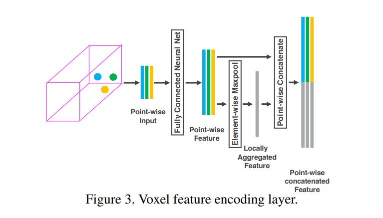

# VoxelNet

VoxelNet: End-to-End Learning for Point Cloud Based 3D Object Detection

pointnet 提出了一种 end-to-end 的对 3d 点云的分割、分类方法。但是 pointnet 的数据输入大多是 1k 数量左右。但是对于 LiDAR 数据集，一般都是 100k 的数量级，pointnet 或者 pointnet++ 的方式会导致计算复杂度爆炸。其次，在 LiDAR 领域有 object detection 的任务，所以想要利用 rpn 来进行目标检测。但是 rpn 的输入需要基于 anchor，在点云数据集上不存在 dense 的这种数据结构，rpn 的流程自然没有办法套用，作者这里就是要解决这个问题

大致流程是
1. 先将图片 voxel 化
2. 用 voxel feature encoding layer（VFE），VFE 的作用是在一个 voxel 内进行特征的提取
3. 在 voxel 上用 rpn（rpn 适合的 dense 的数据组织方式）来的到最后的结果

1. Voxel Partition
    1. 给定点云，假设 voxel 的维度是 $v_D, v_H, v_W$，那么就将范围是 $D,H,W$ 的 3D 图片分为 $D/v_D \times H/v_H \times W/v_W$ 个 voxel
2. Grouping
    1. 根据当前点云所在的位置，分配对应的 voxel
    2. 但是注意到 LiDAR 数据并不是均匀分布的，所以会出现分布不均的情况
3. Random Sampling
    1. 一般来说，Voxel 内的点云数目很多，而且有很多冗余点
    2. 我们采用，每个 voxel 随机抽取 T 个点，不足全部保留的方式，作为输入
4. Stacked Voxel Feature Encoding
    1. 接下来的操作就是堆叠一些列的 VFE 了
    2. VFE 的操作可以在图 3 看到
    3. 首先将一个 voxel 内的点 $p_i=[x_i, y_i, z_i, r_i]^T$ 与中心坐标相减，并 concat 得到 $\hat p_i=[x_i,y_i, z_i, r_i, x_i-v_x,y_i-v_y,z_i-v_z]^T$
    4. 将这个拼接后的向量作为点的特征送到 Fully Connected Net 里，得到一个中心特征
    5. 将这个中心特征和原始特征 concat 起来得到 VFE 的网络输出
5. Sparse Tensor Representation
    1. 这里主要针对的是 non-empty voxel 的表征问题
    2. 将 non-empty voxel 表征成 sparse tensor 将大大减少内存的消耗、计算速度增加、以及 bp 的速度也可以增加
6. 

