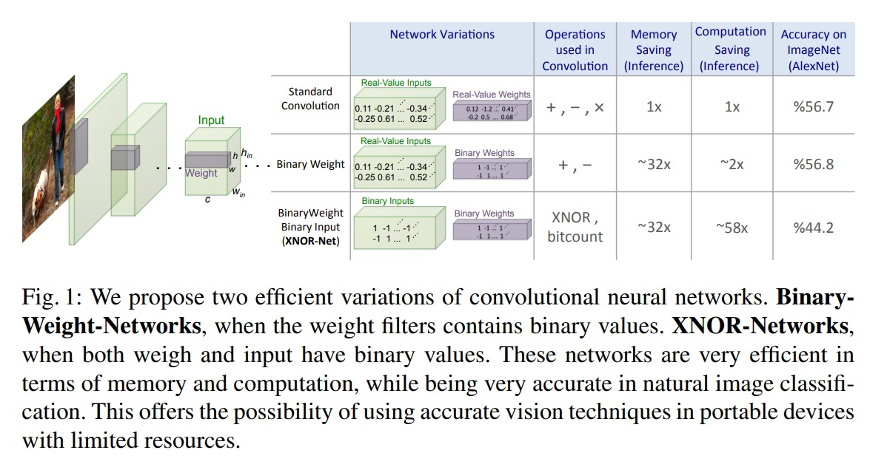
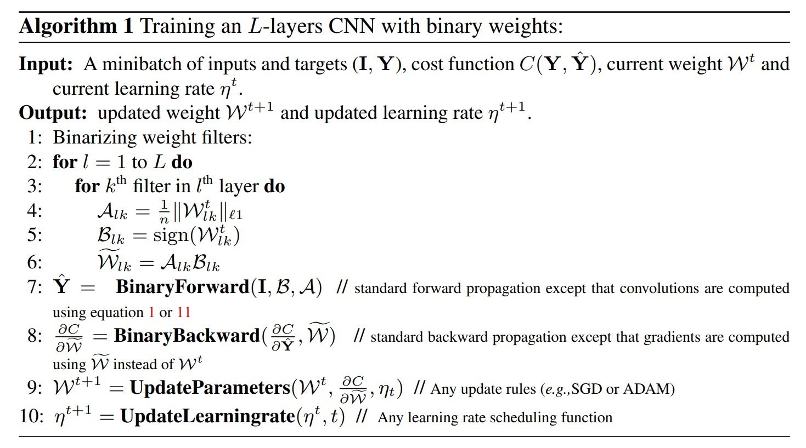
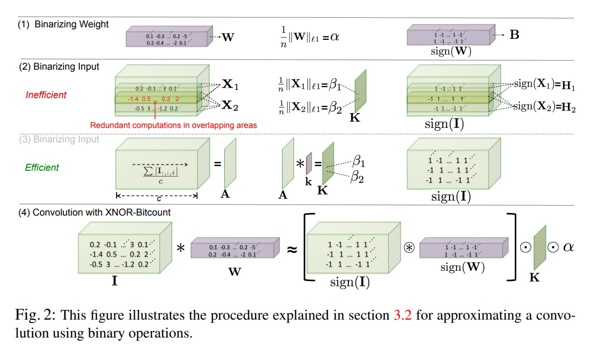

# XNOR 

XNOR-Net: ImageNet Classification Using Binary Convolutional Neural Networks

PDF:
https://arxiv.org/abs/1603.05279.pdf

Code: 
https://allenai.org/plato/xnornet

本文本质上提出了两种 binary CNN 的形式来压缩、加速 NN 的 inference 的速度：

- Binary-weights，所有网络卷积层参数为 binary 形式
- XNOR-Networks，所有网络卷积层参数 和 网络输入 都为 binary 形式

## Binary Weight Networks

- Binary-Weight-Networks
    - 用一个 binary 的 conv filter 再加上一个 scaler 参数 $\alpha$ 来近似原始的卷积核，$\oplus$ 是纯卷积，没有任何加操作。 

$$
I * B \approx (I \oplus \alpha B)
$$

- Estimating Binary Weights，假设 $W,B\in \mathcal{R}^n,n=c\times w\times h$，我们要解一个优化问题
$$
J(B,\alpha) = ||W - \alpha B||^2 \\
\alpha^*, B^* = \arg\min_{\alpha,B}J(B,\alpha)
$$

上述优化问题，可以转化为：
$$
B^* = \argmax_{B}\{W^TB\}, \ \ s.t.\ \ B\in\{+1,-1\}^n \\
\Rightarrow B^*=\text{sign}(W), \alpha^*=W^T B^*/n \\
\Rightarrow \alpha^*=W^TB^*/n=W^T sign(W)/n=\sum |W_i|/n=||W||_{l1}/n
$$

也就是说，根据上述的定义，给定任意的卷积核参数 $W$，我们就能有一个近似的最优 binary 卷积核 $B^*$ 和 他的 scaler $\alpha^*$

- Training Binary-Weights-Networks：在说如何训练之前，我们需要知道符号函数的求导问题。符号函数，在 0 点无法定义导数，其他地方都是 0，所以我们在 bp 的过程中需要对符号函数进行松弛求解。
$$
q = sign(r)
$$
假设 q 的梯度为，$C$ 为损失函数，网络 output 和 groundtruth 计算得到的损失函数
$$
g_q = \partial C / \partial q
$$
那么损失函数 $C$ 对 r 的求导公式如下：

$$
g_r = \partial C/ \partial q · \partial q/\partial r=g_q 1_{|r|\leq 1}
$$
其中，$ 1_{|r|\leq 1}$ 的计算公式为 Htanh，相当于强行将 $\{-1,+1\}$ 区间加入了可导的导数
$$
Htanh(x) = Clip(x, -1,1) = \max(-1,\min(1,x))
$$

有了导数定义之后，我们就可以进行 bp 来更新每个 layer 的参数了。
- 第四行是获取每层的 scaler
- 第五行是获取每层的 binary kernel
- 第六行是获取蒙层最终 binary kernel 的结果
- 第七行是根据当前的 binarize 之后的计算出我们的输出 Y
- 第八行是用标准的 bp 算法，但是用 binary 的 weight 来计算的 gradient
- 第九行是用 sgd 或者 adam 来更新 binary 的 weight
- 第十行是更新 learning rate

## XNOR Networks

在之前的 binary weight network 的工作中，作者仅仅把 convolutional weight 改成了二值化。在 XNOR 网络中，作者将输入也二值化。假设我们的两个输入原始是 $X, W \in \mathcal {R}^n$ 使得 $X^TW\approx \beta H^T \alpha B$，其中 $H,B\in\{+1,-1\}^n$ 以及 $\alpha,\beta$ 都是正实数，那么我们要求解的优化问题就是：
$$
\alpha^*, B^*,\beta^*, H^* = \argmin_{\alpha,B,\beta, H}||X\odot W-\beta\alpha H\odot B||
$$
其中 $\odot$ 是 element-wise 的乘法。那么如果把真实的输出写成 $Y_i = X_iW_i$，以及 $C_i=H_iB_i$，$\gamma = \beta\alpha$ 那么上述优化问题可以转化为：

$$
\gamma^*, C^* = \argmin_{\gamma, C}||Y- \gamma C||
$$
同理可得 optimal solution 应该是：
$$
H^* = sign(X) \\
N^* = sign(W) \\
\gamma^* = \beta^*\alpha^*
$$

接下来就是 figure 2 里具体的网络流程。在具体实现的时候，为了减少冗余计算，实际上会进行一些计算上的变形。xnor 和 bwn 在本质上加速的原因其实就是将矩阵乘法变成一个 1 位的 xnor 门操作，这就是加速的核心点。

